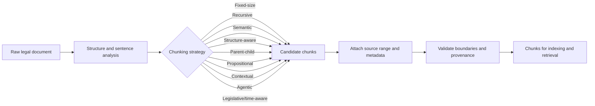
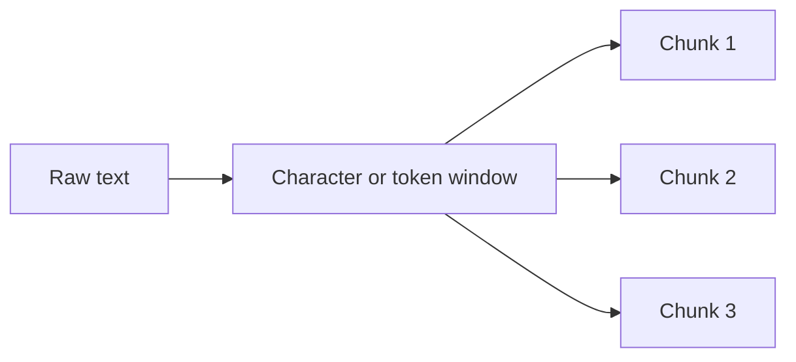
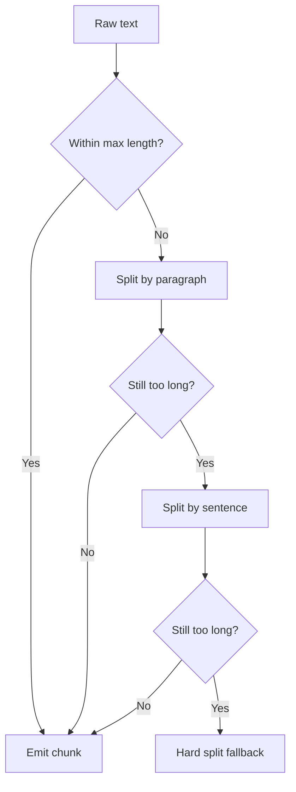
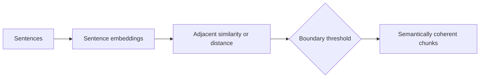
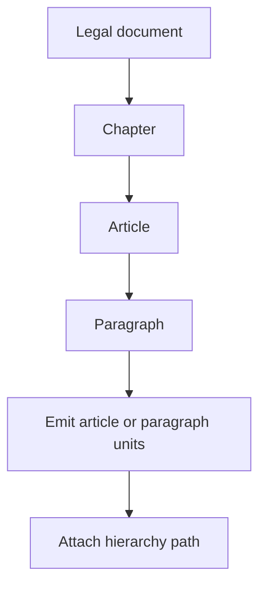
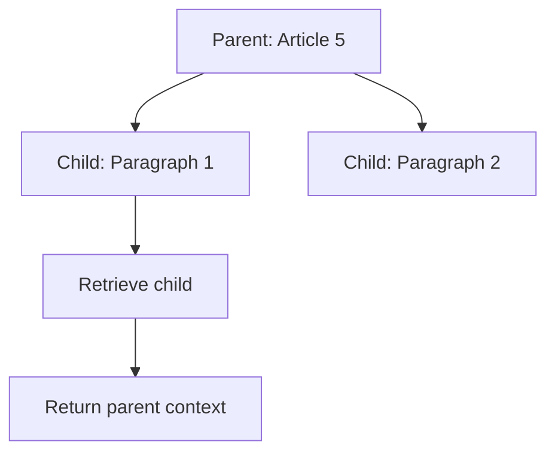
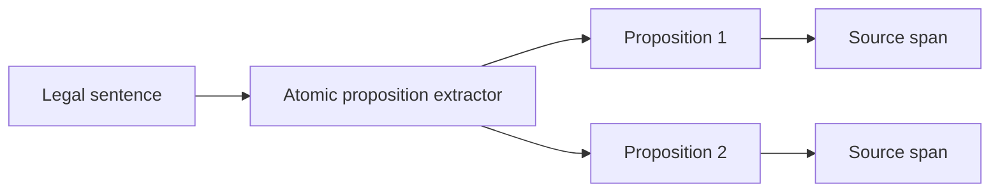
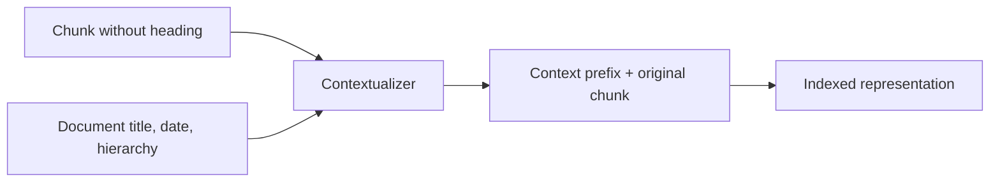
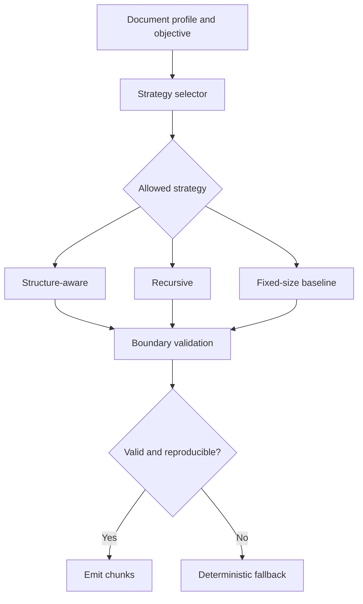
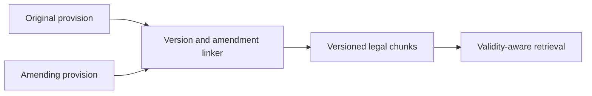

# Literature Review: Legal-Document _Chunking_

## 1. Definition and scope

_Chunking_ is the process of dividing a document into smaller units for storage, indexing, retrieval, or processing by a language model. In information-retrieval systems, the unit that is indexed constitutes a methodological decision: it may be a document, paragraph, sentence, or proposition. Chen et al. show that the granularity of the retrieval unit affects retrieval performance and downstream tasks, and introduce propositions as self-contained atomic units ([Chen et al., 2024](https://doi.org/10.48550/arXiv.2312.06648)).

This review limits _chunking_ to the determination of boundaries, size, inter-chunk relationships, and context augmentation. _Chunking_ is distinct from indexing, ranking, entity extraction, and answer generation. Two frequently competing objectives are **retrieval precision**, achieved through sufficiently focused units, and **context completeness**, achieved through sufficiently intact units. Appropriate chunk boundaries should preserve normative units, references, negation, exceptions, and inter-sentence relationships required to interpret a provision.

## 2. Taxonomy of approaches

| Approach                    | Principle                                                                                                        | Strengths                                                                 | Weaknesses and assumptions                                                                                                                       | Suitability for legal documents                                                                                                                                                                                                                       |
| --------------------------- | ---------------------------------------------------------------------------------------------------------------- | ------------------------------------------------------------------------- | ------------------------------------------------------------------------------------------------------------------------------------------------ | ----------------------------------------------------------------------------------------------------------------------------------------------------------------------------------------------------------------------------------------------------- |
| Fixed-size                  | Forms character-, word-, or token-length windows of a fixed size, with or without overlap                        | Deterministic, inexpensive, easy to reproduce, and suitable as a baseline | May split sentences, definitions, conditions, or exceptions; assumes that size is an adequate proxy for context                                  | Useful as an experimental control, but insufficient as the sole strategy for normative text                                                                                                                                                           |
| Recursive                   | Attempts separators from larger units to smaller units, then applies hard splitting if the text remains too long | Preserves paragraphs or sentences without requiring a semantic model      | Sensitive to the separator list, punctuation, and segmentation quality; does not understand the legal function of a section                      | Useful as a baseline or _fallback_, with separator lists tested for Indonesian                                                                                                                                                                        |
| Sentence-based and semantic | Uses sentence boundaries or changes in inter-sentence semantic similarity                                        | Can preserve coherent discourse or topical units                          | Requires a segmenter and, in the semantic variant, a model and threshold; topic changes are not always equivalent to legal-obligation boundaries | Suitable for explanatory text and non-uniform documents, but requires checking that conditions and exceptions remain adjacent                                                                                                                         |
| Structure-aware             | Uses headings, sections, numbers, block types, or document hierarchies as boundaries and metadata                | Auditable and preserves source structure                                  | Requires structure recognition that is robust to format variation and OCR errors                                                                 | Highly relevant because official sources regulate the types, hierarchy, and drafting techniques of legislation ([Law No. 12 of 2011, BPK Legal Information and Documentation Network](https://peraturan.bpk.go.id/Details/39188/uu-no-12-tahun-2011)) |
| Parent–child                | Indexes small child units, then retrieves a parent unit or broader context                                       | Balances retrieval focus and context completeness                         | Requires stable relationships, parent recovery, and a context-boundary policy; context may be repeated                                           | Relevant to section–subsection relationships, provided that the parent stores source references and does not alter normative text                                                                                                                     |
| Propositional               | Converts sentences into concise, self-contained atomic statements for retrieval                                  | High granularity and the ability to target particular facts               | Extraction may remove scope, modality, negation, or inter-clause relationships                                                                   | May be used for factual questions, but each legal proposition must be linked to source text and validated by experts                                                                                                                                  |
| Contextual                  | Adds concise document-derived context to each chunk before retrieval                                             | Reduces ambiguity when a chunk lacks a heading, subject, or time range    | Additional context may be incorrect, increases preprocessing cost, and risks mixing interpretation with quotation                                | Appropriate when the context is extractive or has clear _provenance_; generative context should be tested separately ([Anthropic, 2024](https://www.anthropic.com/news/contextual-retrieval))                                                         |
| Agentic                     | An agent selects a strategy, size, or context according to document content and question objectives              | Adaptive to heterogeneous documents                                       | Not always deterministic, costly, difficult to reproduce, and more difficult to audit                                                            | Appropriate only with a limited action space, decision traces, structural validation, and a prohibition on generating new norms                                                                                                                       |
| Legislative- and time-aware | Combines legislative units, amendment references, dates, versions, and validity status                           | Supports cross-version tracing and _provenance_                           | Requires official sources, conflict resolution, and representation of partial changes                                                            | Relevant to Indonesian regulations; version management must not be inferred solely from textual proximity                                                                                                                                             |

Size and overlap are not approaches in themselves, but parameters that span approaches. Larger units tend to increase available context but may reduce focus and increase cost; overlap may reduce context loss at boundaries but increases duplication. Accordingly, size, overlap, and structural units should be compared as experimental factors rather than selected solely according to general rules.

## 3. Conceptual pipeline and input/output example

The following diagram shows a literature-based chunking pipeline. It is a conceptual reference model, not a claim about any particular implementation.



### Example

**Input**

```text
Article 5. The institution shall retain the record for five years.
Paragraph (1). The retention period begins on the date of registration.
```

**Structure-aware output**

```text
Chunk 1
text: "Article 5. The institution shall retain the record for five years."
metadata: {article: 5, paragraph: null, source_range: [1, 66]}

Chunk 2
text: "Paragraph (1). The retention period begins on the date of registration."
metadata: {article: 5, paragraph: 1, source_range: [68, 138]}
```

The ranges use one-based character offsets and exclude the line break between the two input lines. The output preserves the source text, records the structural path, and exposes the boundary decision for later indexing and evaluation. A fixed-size strategy could produce different boundaries, which is precisely why the strategies must be compared empirically.

## 4. Generic pseudocode

The following pseudocode describes methodological behavior at an abstract level. The `emit` function stores text, source ranges, and metadata; it does not imply any particular technology.

### 4.1 Fixed size

```text
FIXED_SIZE(text, size, overlap):
    validate(size > 0 and 0 <= overlap < size)
    result = []
    start = 0
    while start < length(text):
        end = minimum(start + size, length(text))
        result.append(text[start:end])
        if end == length(text): break
        start = end - overlap
    return result
```

### 4.2 Recursive

```text
RECURSIVE_SPLIT(text, separators, max_length):
    if length(text) <= max_length: return [text]
    if separators is empty: return FIXED_SIZE(text, max_length, 0)

    separator = first_separator_found(text, separators)
    if separator is not found:
        return RECURSIVE_SPLIT(text, separators[1:], max_length)

    parts = split(text, separator)
    groups = pack_in_order_without_exceeding(parts, max_length)
    result = []
    for item in groups:
        result.extend(RECURSIVE_SPLIT(item, separators[1:], max_length))
    return result
```

### 4.3 Sentence-based or semantic

```text
SEMANTIC_SEGMENT(sentences, threshold, max_length):
    vectors = encode(each sentence)
    boundaries = [0]
    for i from 1 to count(sentences) - 1:
        distance = distance_between(vectors[i - 1], vectors[i])
        if distance >= threshold: boundaries.append(i)
    boundaries.append(count(sentences))

    candidates = merge_ranges(sentences, boundaries)
    return split_if_exceeding(candidates, max_length,
                              method=RECURSIVE_SPLIT)
```

### 4.4 Legal structure-aware

```text
LEGAL_STRUCTURE(document, max_length):
    tree = parse_structure(document)
    result = []
    for unit in source_order(tree):
        path = hierarchy_path(unit)
        text = render(unit)
        if length(text) <= max_length:
            emit(result, text, source=unit, metadata=path)
        else:
            subunits = split_by_children(unit)
            for part in subunits:
                pieces = RECURSIVE_SPLIT(render(part),
                                         language_separators, max_length)
                emit_each(pieces, source=part, metadata=path)
    validate_source_ranges_and_order(result)
    return result
```

### 4.5 _Parent–child_

```text
PARENT_CHILD(document, child_limit, parent_scope):
    result = []
    for parent_unit in structure(document):
        parent = create_chunk(render(parent_unit), metadata=path(parent_unit))
        store(parent)
        result.append(parent)
        children = split_into_children(parent_unit, child_limit)
        for child in children:
            child_chunk = create_chunk(render(child), metadata=path(child))
            emit(result, child_chunk.text, parent_id=parent.id,
                 source=child.source, metadata=path(child))
    validate_all_parent_ids(result)
    return select_children_and_parents(result, parent_scope)
```

### 4.6 Propositional

```text
PROPOSITIONAL(text, extractor):
    sentences = sentence_split(text)
    propositions = extractor.to_atomic_statements(sentences)
    result = []
    for proposition in propositions:
        proposition = preserve_modality_negation_and_entities(proposition)
        emit(result, proposition, source_span=source_alignment(proposition),
             type="proposition")
    return result
```

### 4.7 Contextual

```text
CONTEXTUALIZE(chunk, document_context, contextualizer):
    context = contextualizer(document_context, chunk)
    context = validate_against_source(context, document_context)
    return combine(context, chunk, provenance=source_alignment(context))
```

### 4.8 Agentic approach with a limited action space

```text
AGENTIC_CHUNK(document, objectives, allowed_strategies):
    profile = agent.choose_strategy(document, objectives, allowed_strategies)
    result = run(profile.strategy, document, profile.parameters)
    result = validate_hard_boundaries(result, document.structure)
    result = audit_provenance_and_reproducibility(result, profile)
    if validation_failed(result):
        result = use_deterministic_baseline(document)
    return result
```

### 4.9 Legislative- and time-aware

```text
VERSIONED_CHUNKS(original_documents, amendments, validity_records):
    units = extract_legal_units(original_documents)
    changes = extract_amendment_relations(amendments)
    result = []
    for unit in units:
        versions = apply_traced_changes(unit, changes)
        for version in versions:
            validity = lookup_validity(version, validity_records)
            emit(result, version.text,
                 source=version.source,
                 metadata={version_id: version.id,
                           valid_from: validity.start,
                           valid_until: validity.end,
                           relations: version.relations})
    validate_version_order_and_provenance(result)
    return result
```

## 5. Approach-by-approach visual examples

The examples below use the same short legal text where possible. They illustrate the transformation performed by each strategy; they are not benchmark results and do not prescribe a production configuration.

### 5.1 Fixed-size chunking



**Input**

```text
Article 5. The institution shall retain the record for five years.
```

**Output with size = 32 characters and overlap = 8**

```text
Chunk 1: "Article 5. The institution shall"
Chunk 2: "on shall retain the record for f"
Chunk 3: "rd for five years."
```

The boundaries are deterministic but may split a word, sentence, definition, or exception.

### 5.2 Recursive chunking



**Input**

```text
Paragraph 1. The institution shall retain the record for five years.
Paragraph 2. The retention period begins on the date of registration.
```

**Output**

```text
Chunk 1: "Paragraph 1. The institution shall retain the record for five years."
Chunk 2: "Paragraph 2. The retention period begins on the date of registration."
```

The algorithm preserves the largest available separator before using a smaller separator or hard split.

### 5.3 Sentence-based or semantic chunking



**Input**

```text
S1: The institution shall retain the record for five years.
S2: The retention period begins on the date of registration.
S3: The authority may extend the period during an investigation.
```

**Output**

```text
Chunk 1: S1 + S2
Chunk 2: S3
metadata: {boundary_reason: "semantic distance above threshold"}
```

The result depends on the sentence segmenter, embedding model, distance function, and threshold.

### 5.4 Structure-aware chunking



**Input**

```text
Chapter II
Article 5
Paragraph (1). The institution shall retain the record for five years.
Paragraph (2). The retention period begins on registration.
```

**Output**

```text
Chunk 1: Paragraph (1) text
metadata: {chapter: II, article: 5, paragraph: 1}

Chunk 2: Paragraph (2) text
metadata: {chapter: II, article: 5, paragraph: 2}
```

The boundary follows the legal hierarchy instead of a character-count threshold alone.

### 5.5 Parent–child chunking



**Input**

```text
Article 5
Paragraph (1). The institution shall retain the record for five years.
Paragraph (2). The retention period begins on registration.
```

**Output**

```text
Indexed children:
  child_5_1 -> parent_5
  child_5_2 -> parent_5

Retrieved context:
  child_5_1 + parent_5
```

The child improves retrieval focus while the parent supplies broader context.

### 5.6 Propositional chunking



**Input**

```text
The institution shall retain the record for five years and notify the authority within ten days.
```

**Output**

```text
Proposition 1: The institution shall retain the record for five years.
Proposition 2: The institution shall notify the authority within ten days.
source_span: each proposition remains linked to the original sentence
```

Modality, negation, conditions, exceptions, and source alignment must be preserved.

### 5.7 Contextual chunking



**Input**

```text
Document context: Regulation 12/2024, Chapter II, Article 5
Chunk: The institution shall retain the record for five years.
```

**Output**

```text
Contextualized chunk:
"Regulation 12/2024, Chapter II, Article 5: The institution shall retain the record for five years."
provenance: {context_source: document_metadata, original_chunk: true}
```

Generated context must remain distinguishable from the normative quotation.

### 5.8 Agentic chunking with constrained strategies



**Input**

```text
document_profile: {has_article_structure: true, OCR_quality: high}
objective: maximize normative-unit integrity under a 512-token budget
allowed_strategies: [structure-aware, recursive, fixed-size]
```

**Output**

```text
selected_strategy: structure-aware
parameters: {max_length: 512}
decision_trace: [structure_detected, strategy_selected, boundaries_validated]
chunks: [chunk_1, chunk_2, ...]
```

The action space, fallback, decision trace, and reproducibility controls are part of the method.

### 5.9 Legislative- and time-aware chunking



**Input**

```text
Original: Article 5. The retention period is five years. [valid from 2022]
Amendment: Article 5 is changed to seven years. [valid from 2024]
```

**Output**

```text
Chunk A: {text: "five years", valid_until: 2024, relation: amended_by B}
Chunk B: {text: "seven years", valid_from: 2024, relation: amends A}
```

The chunk must preserve version identity and amendment provenance so that retrieval does not merge incompatible legal states.

## 6. Data, benchmarks, and metrics

| Source or framework                                                                              | Evaluation focus                                                                  | Relevant metrics                                                                                  | Limitations                                                                                                                    |
| ------------------------------------------------------------------------------------------------ | --------------------------------------------------------------------------------- | ------------------------------------------------------------------------------------------------- | ------------------------------------------------------------------------------------------------------------------------------ |
| **BEIR** ([Thakur et al., 2021](https://doi.org/10.48550/arXiv.2104.08663))                      | Cross-domain retrieval with several retriever families                            | _Recall@k_, MRR, and nDCG                                                                         | Not an Indonesian legal corpus; has no annotations specifically for normative-unit boundaries                                  |
| **NitiBench-CCL/Tax** ([Akarajaradwong et al., 2025](https://doi.org/10.48550/arXiv.2502.10868)) | Thai legal QA, the effect of _section-based chunking_, and coverage/contradiction | _Multi-label retrieval recall_, _coverage_, and _contradiction_                                   | Thai language, structure, and law cannot be considered identical to those of Indonesia; results cannot be transferred directly |
| **Dense X Retrieval** ([Chen et al., 2024](https://doi.org/10.48550/arXiv.2312.06648))           | Comparison of document, passage, sentence, and proposition granularity            | Retrieval accuracy and QA performance under a specified computational budget                      | General study; legal propositions require validation of modality and _provenance_                                              |
| Expert boundary annotation                                                                       | Agreement between boundaries and discourse or normative units                     | _Boundary precision/recall/F1_, boundary-shift distance, and the percentage of intact legal units | Requires annotation guidelines, at least two annotators, and adjudication; not yet a universal benchmark                       |
| Question- and _qrels_-based evaluation                                                           | Whether all required units are retrieved                                          | _Recall@k_, _precision@k_, MRR, nDCG, and _parent/context completeness_                           | Highly dependent on label completeness; a single reference answer may underestimate multi-article requirements                 |
| Context and efficiency audit                                                                     | Completeness, duplication, and cost                                               | Chunk length, token count, overlap ratio, storage size, time, memory, and latency                 | Token counts depend on the tokenizer and model used                                                                            |
| **RAGAS** ([Es et al., 2023](https://doi.org/10.48550/arXiv.2309.15217))                         | Context relevance and output faithfulness in _RAG_                                | _Context precision/recall_ and reference-based or model-judged generation metrics                 | Reference-free evaluation may be biased and does not replace legal-expert annotation                                           |

For fair comparison, the corpus should be split by document and temporal version rather than solely by random chunks. Questions should cover regulation-identity retrieval, number references, semantic questions, exceptions, and questions requiring multiple sections. In addition to aggregate metrics, report per-document variation, confidence intervals, and failure cases.

## 7. Considerations for Indonesian legal documents and regulations

1. Structures used as boundaries should be derived from source texts and legislative-drafting guidelines, rather than from the assumption that all documents follow the same pattern. [Law No. 12 of 2011](https://peraturan.bpk.go.id/Details/39188/uu-no-12-tahun-2011) specifies the types, hierarchy, subject matter, and drafting techniques of legislation and is recorded as having undergone amendments. This supports the need for structural and version metadata, but does not prescribe a _chunking_ algorithm.
2. Numbers, definitions, cross-references, exception phrases, modal words, and appendices should be treated as units that must not be separated without relationship markers. This is a domain evaluation criterion, not a guarantee that any strategy is always correct.
3. Amendments or repeals should be stored together with their dates, source documents, and amendment relationships. A chunk that combines versions without an indicator may cause two legal states to be read as a single provision.
4. Official sources should be preserved through source ranges, document identities, and access versions. Model-generated contextual text must not be treated as normative quotation.
5. NitiBench indicates that _section-based chunking_ and multi-label evaluation merit consideration in legal QA; however, its status as a Thai legal study makes transfer to Indonesian regulations a hypothesis requiring testing.

## 8. Neutral comparison framework

Use the following checklist to compare any implementation without turning the results into unsupported claims:

- [ ] Are the output unit, measurement unit, and overlap rules defined explicitly?
- [ ] Can the boundary of each chunk be traced to a source range and a document-structure path?
- [ ] Are sentences, definitions, negation, conditions, exceptions, cross-references, and appendices tested as separate cases?
- [ ] Are deterministic and model-based strategies compared using the same corpus, budget, and protocol?
- [ ] Do the _qrels_ contain all required sections rather than only one passage deemed correct?
- [ ] Are _Recall@k_, MRR, nDCG, context/parent completeness, boundary quality, duplication, cost, and latency reported together?
- [ ] Is variation by document type, length, OCR quality, language, and temporal version reported?
- [ ] For generative or agentic context, are sources, prompts, decisions, seeds, and fallbacks recorded?
- [ ] Do changes in the results originate from the _chunking_ strategy, or did the retriever, embedding, reranker, and generator also change?
- [ ] Is legal-expert assessment conducted blindly with respect to the configuration?

## 9. Research gaps and questions

- No public benchmark specifically evaluates boundary integrity in Indonesian-language regulations with complete normative-unit annotations.
- The relationship among chunk size, _overlap_, OCR quality, and cross-article context requirements lacks consistent evidence in Indonesian corpora.
- The effects of propositions and model-generated context on legal modality, negation, and exceptions remain open questions.
- Evaluation of _agentic chunking_ requires clearer reproducibility protocols and safety boundaries than ordinary retrieval evaluation.
- Cross-amendment chunk modeling requires a temporally versioned dataset and annotations of relationships between original and amended text.

Defensible research questions include: (1) which strategy best preserves normative-unit integrity across different classes of Indonesian documents; (2) how do size and overlap trade-offs affect _Recall@k_, context completeness, cost, and latency; (3) do _parent–child_ units, propositions, or sourced context improve retrieval without increasing contradictions; and (4) does the benefit of _chunking_ persist when the retriever, reranker, and context budget are controlled?

## 10. Verified references

- Chen, T. et al. (2024). “Dense X Retrieval: What Retrieval Granularity Should We Use?” DOI arXiv `10.48550/arXiv.2312.06648`, [arXiv](https://arxiv.org/abs/2312.06648).
- Akarajaradwong, P. et al. (2025). “NitiBench: A Comprehensive Study of LLM Framework Capabilities for Thai Legal Question Answering.” DOI arXiv `10.48550/arXiv.2502.10868`, [arXiv](https://arxiv.org/abs/2502.10868).
- Thakur, N. et al. (2021). “BEIR: A Heterogeneous Benchmark for Zero-shot Evaluation of Information Retrieval Models.” DOI arXiv `10.48550/arXiv.2104.08663`, [arXiv](https://arxiv.org/abs/2104.08663).
- Es, S. et al. (2023). “Ragas: Automated Evaluation of Retrieval Augmented Generation.” DOI arXiv `10.48550/arXiv.2309.15217`, [arXiv](https://arxiv.org/abs/2309.15217).
- Anthropic. (2024). “Introducing Contextual Retrieval.” [Official source](https://www.anthropic.com/news/contextual-retrieval).
- Audit Board of the Republic of Indonesia. (2011, as recorded on the official website). “UU No. 12 Tahun 2011 tentang Pembentukan Peraturan Perundang-Undangan.” [BPK Legal Information and Documentation Network](https://peraturan.bpk.go.id/Details/39188/uu-no-12-tahun-2011).
