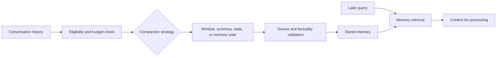
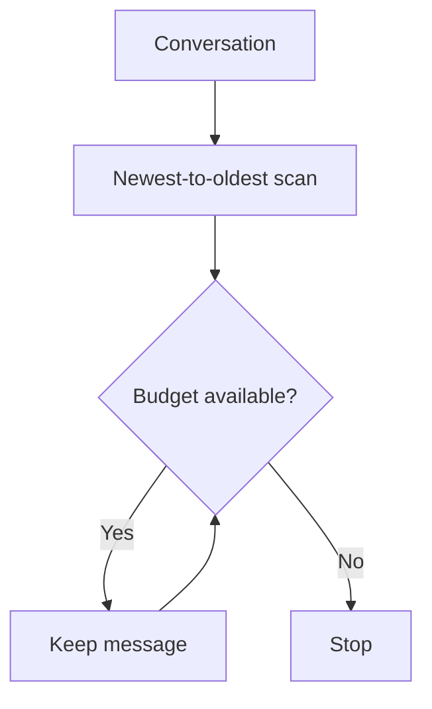
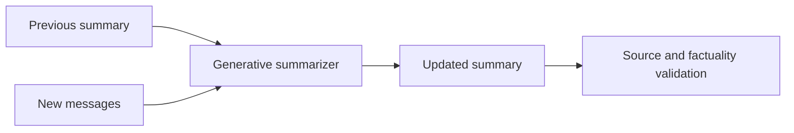
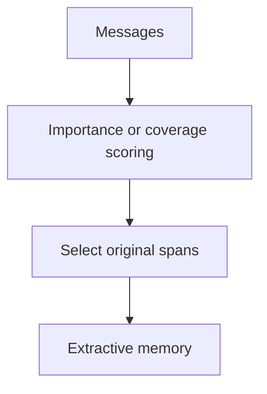
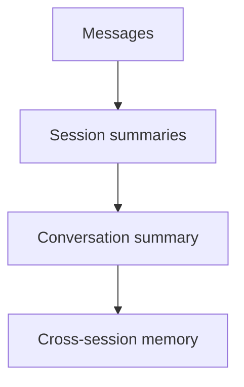
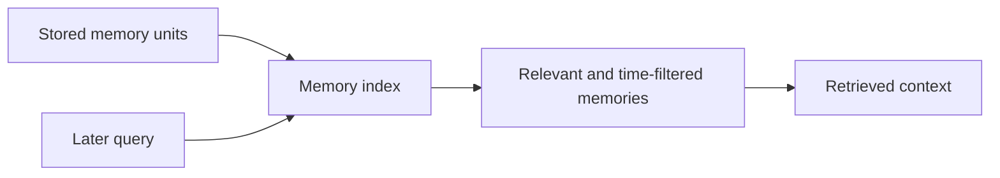
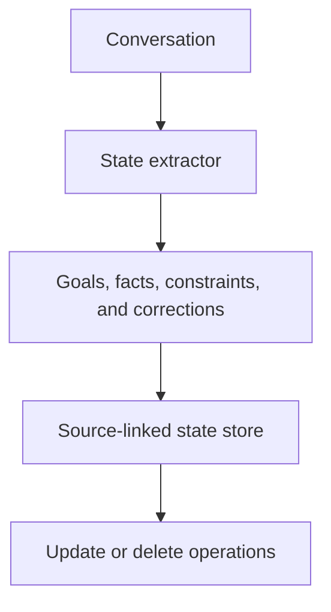
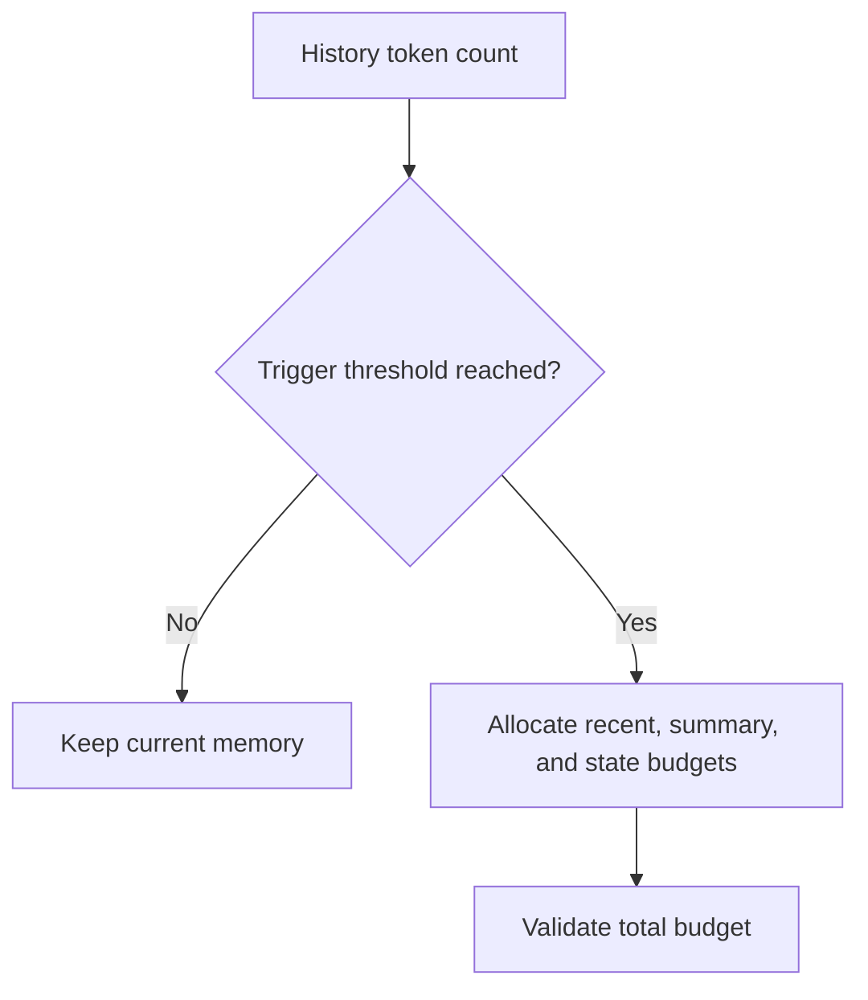
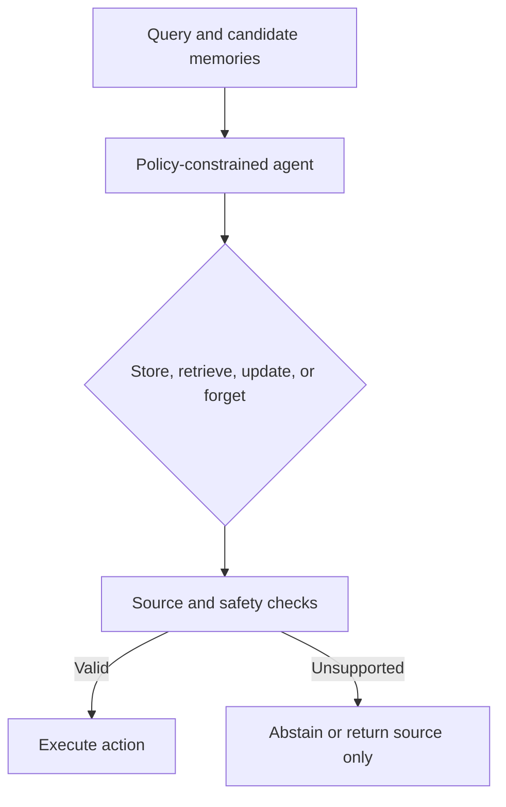

# Literature Review: _History Compaction_ and Conversational Memory

## 1. Definition and scope

A _history compactor_ is a component that reduces the representation of conversation history so that important information can be retained within specified token, cost, and latency limits. It may perform truncation, summarization, state extraction, memory storage, or memory retrieval. It is not merely a token counter: the decision about what to preserve determines a system’s ability to answer questions that refer to earlier conversation.

This review discusses raw history, _rolling summaries_, hierarchical memory, retrieval-based memory, structured-state extraction, token-budget-based compaction, and agentic strategies. The evaluation focus is factuality, retention, forgetting, knowledge updating, cost, and latency. “Memory” here means a representation of the conversation available for subsequent processing; it does not assert any particular ownership, location, or implementation.

## 2. Taxonomy of approaches

| Approach | Principle | Strengths | Weaknesses and assumptions | Suitability for legal conversations |
|---|---|---|---|---|
| Full raw history | Sends all messages without compaction | Highest fidelity and provenance | Token use, cost, and latency increase; constrained by the context window | Important baseline for short sessions and for factuality comparison |
| Recent window/truncation | Retains the most recent N messages or tokens | Deterministic, inexpensive, and low-latency | Forgets earlier decisions, definitions, and corrections; boundaries may split turns | Suitable for local context, but insufficient when earlier status or references remain decisive |
| _Rolling abstractive summary_ | Updates an earlier summary with new messages using a generative model | Concise and coherent; can preserve goals or decisions | Hallucination, omission of negation/exceptions, and accumulation of errors | Requires linking claims to source messages and a correction mechanism |
| _Rolling extractive summary_ | Selects important sentences or spans without generating new facts | Easy to audit and lower fabrication risk | Less coherent and may fail to resolve coreference | Attractive for legal facts that must be preserved verbatim |
| Hierarchical memory | Stores multiple levels, such as messages, sessions, and cross-session summaries; RAPTOR demonstrates an analogous hierarchy of summaries for document retrieval ([Sarthi et al., 2024](https://doi.org/10.48550/arXiv.2401.18059)) | Provides multiple granularities | Lower-level errors may propagate; updates and coverage are complex | Suitable if each level stores version, source, and status information |
| Retrieval-based memory | Stores memory units and retrieves those relevant to a query | Does not require the entire history to be sent; supports long sessions | The retriever may miss important facts, retrieve obsolete memories, or produce conflicts | Suitable when retrieval considers time and source validity |
| State/fact extraction | Converts conversation into goals, constraints, decisions, open questions, corrections, or status | Structured and testable representation | Incorrect extraction changes the state; requires add, update, delete, and conflict operations | Appropriate when legal facts have sources, versions, and certainty levels |
| Token-budget-based compaction | Triggers compaction at a threshold and allocates a budget per component | Explicit cost and latency control | Tokenizer estimates may be inaccurate; allocation rules may prioritize the wrong information | Requires a reserved budget for quotations, identifiers, negation, and caveats |
| Agentic/reflective memory | An agent selects what to store, retrieve, update, or forget | Adaptive to goals and changes | Non-deterministic, costly, difficult to audit, and at risk of storing PII or incorrect facts | Must have policies, decision logs, source verification, and an abstention mechanism |

LongMemEval formulates long-term memory as the stages **indexing**, **retrieval**, and **reading**, and evaluates information extraction, multi-session reasoning, temporal reasoning, knowledge updating, and abstention ([Wu et al., 2025](https://doi.org/10.48550/arXiv.2410.10813)). This separation is useful for preventing a compaction failure from being misinterpreted as a generation-model failure.

## 3. Conceptual pipeline and input/output example

The following diagram is a literature-based reference model for conversational-memory compaction. It is not a claim about a particular implementation.



### Example

**Input**

```text
User: Regulation 12/2024 changes the retention period to five years.
Assistant: I will use the 2024 version for later questions.
Later query: Which retention period should be used?
```

**Output**

```text
memory_item: {
  fact: "Regulation 12/2024 uses a five-year retention period",
  source_messages: [1, 2],
  status: confirmed,
  version: 2024
}
```

The memory representation preserves the fact, source messages, status, and version rather than storing an unsupported free-form summary alone.

## 4. Generic pseudocode

```text
RECENT_WINDOW(messages, token_budget, minimum_messages):
    selected = []
    for message from newest to oldest:
        if token_count(selected + message) <= token_budget
           or count(selected) < minimum_messages:
            selected.prepend(message)
        else: break
    return selected
```

```text
ROLLING_SUMMARY(previous_summary, compactable_messages, summarizer):
    if summarizer is available:
        candidate = summarizer(previous_summary, compactable_messages,
                               preserve=[facts, goals, constraints,
                                         decisions, corrections, open_questions])
    else:
        candidate = extractive_select(previous_summary, compactable_messages)
    return validate_against_sources(candidate, compactable_messages)
```

```text
HIERARCHICAL_MEMORY(conversation, levels, summarizers):
    level[0] = conversation.messages
    for level_number from 1 to levels:
        groups = group_by_session_or_time(level[level_number - 1])
        level[level_number] = [summarizers[level_number](group)
                               for group in groups]
        attach_coverage_and_source_ids(level[level_number], groups)
    return level
```

```text
RETRIEVAL_MEMORY(query, memory_store, time_policy, k):
    candidates = memory_store.search(query)
    candidates = filter_by_scope_and_time(candidates, time_policy)
    candidates = remove_duplicates_and_conflicts(candidates)
    return rank_by_relevance_recency_and_provenance(candidates)[0:k]
```

```text
EXTRACT_STATE(messages, schema, extractor):
    candidates = extractor(messages, schema)
    valid = []
    for item in candidates:
        if item.has_source_id and item.type in schema.types:
            valid.append(item)
    return resolve_updates_conflicts_and_deletions(valid)
```

```text
COMPACT(conversation, budget, policy):
    eligible = select_messages(conversation, policy.eligibility)
    if token_count(eligible) <= budget.trigger: return SKIPPED

    recent = RECENT_WINDOW(eligible, budget.recent, policy.min_messages)
    old = eligible - covered_by_previous_memory(eligible) - recent
    summary = ROLLING_SUMMARY(previous_summary(conversation), old,
                              policy.summarizer)
    state = None
    if policy.use_state:
        state = EXTRACT_STATE(old + recent, policy.state_schema,
                              policy.state_extractor)
    memory = allocate_budget(summary, state, recent, budget.total)
    validate_factuality_and_source_coverage(memory, old + recent)
    persist_with_coverage(memory)
    return memory
```

```text
AGENTIC_MEMORY_DECISION(query, candidates, policy):
    decision = agent.choose([store, retrieve, update, forget],
                            candidates, policy.allowed_actions)
    require decision.explanation and decision.source_ids
    result = execute_with_budget(decision)
    verify_no_unsupported_claims(result)
    if verification_fails: abstain_or_return_source_only()
    return result
```

## 5. Approach-by-approach visual examples

The examples below illustrate how each memory strategy transforms conversation history. They are conceptual examples, not benchmark results or production prescriptions.

### 5.1 Full raw history


**Input**

```text
Messages 1 through 20, including all user and assistant turns.
```

**Output**

```text
context: messages 1 through 20
source coverage: complete
```

Full history provides a useful fidelity baseline, but token cost and context-window limits grow with the session.

### 5.2 Recent-window truncation



**Input**

```text
Messages: [M1, M2, M3, M4]
Budget: enough for [M3, M4]
```

**Output**

```text
context: [M3, M4]
dropped: [M1, M2]
```

The method is deterministic and inexpensive, but earlier decisions and definitions may disappear.

### 5.3 Rolling abstractive summary



**Input**

```text
Previous summary: The user is reviewing retention rules.
New message: Regulation 12/2024 changes the period to five years.
```

**Output**

```text
summary: The user is reviewing Regulation 12/2024, which sets a five-year period.
source_messages: [new message]
```

Abstraction saves space, but every claim should be checked for omission, negation, and source support.

### 5.4 Rolling extractive summary



**Input**

```text
M1: The applicable regulation is Regulation 12/2024.
M2: It sets a five-year retention period.
M3: We can discuss implementation later.
```

**Output**

```text
selected spans: [M1, M2]
memory: original wording retained
```

Extractive selection limits fabrication risk but may preserve less coherent context and resolve fewer references.

### 5.5 Hierarchical memory



**Input**

```text
Session 1: identify the regulation and retention period.
Session 2: compare the amendment and the earlier version.
```

**Output**

```text
session_1: {regulation: 12/2024, period: five years}
session_2: {comparison: 12/2024 versus 3/2020}
global_memory: {topic: retention, sources: [session_1, session_2]}
```

Multiple levels support different scopes, but coverage and update errors can propagate between levels.

### 5.6 Retrieval-based memory



**Input**

```text
Query: What retention period applies under Regulation 12/2024?
Memory units: [M1 regulation identity, M2 five-year period, M3 unrelated topic]
```

**Output**

```text
retrieved: [M1, M2]
excluded: [M3, reason: low relevance]
```

Retrieval avoids sending all history, but it can miss decisive memories or return stale and conflicting items.

### 5.7 Structured state or fact extraction



**Input**

```text
User: Use Regulation 12/2024, not the repealed 3/2020 version.
```

**Output**

```text
state: {
  active_regulation: 12/2024,
  excluded_regulation: 3/2020,
  source_message: M7,
  status: confirmed
}
```

Structured memory makes updates and conflicts explicit, but extraction errors can change the stored state.

### 5.8 Token-budget-based compaction



**Input**

```text
token_count: 7,200
trigger: 6,000
budget: {recent: 1,500, summary: 800, state: 400}
```

**Output**

```text
memory_budget_used: {recent: 1,480, summary: 760, state: 320}
total: 2,560 tokens
```

Explicit budgets control cost, but allocation rules must protect quotations, identifiers, negation, and caveats.

### 5.9 Agentic or reflective memory



**Input**

```text
query: Is the five-year period still applicable?
candidate: Regulation 12/2024, status: confirmed, source: M7
allowed_actions: [retrieve, update, abstain]
```

**Output**

```text
decision: retrieve
reason: candidate matches regulation and question
source_ids: [M7]
fallback: abstain if validity cannot be verified
```

Agentic memory requires a limited action space, decision trace, source verification, and safe abstention.

## 6. Data, benchmarks, and metrics

| Dataset/framework | Measurement focus | Metrics or tasks | Limitations |
|---|---|---|---|
| **LoCoMo** ([Maharana et al., 2024](https://doi.org/10.18653/v1/2024.acl-long.747)) | Very long conversations spanning many sessions, QA, event summarization, and temporal/causal dynamics | Long-term memory QA accuracy, event-summary quality, and multimodal dialogue | Not Indonesian or legal-domain data; multimodality is not always necessary |
| **LongMemEval** ([Wu et al., 2025](https://doi.org/10.48550/arXiv.2410.10813)) | Extraction, multi-session reasoning, temporality, knowledge updating, and abstention | Memory/QA accuracy and analysis of the indexing–retrieval–reading stages | General domain; legal questions, regulatory status, and provenance requirements need to be added |
| **QMSum** ([Zhong et al., 2021](https://doi.org/10.18653/v1/2021.naacl-main.472)) | Query-based meeting summarization across domains | ROUGE and segment-based summary quality | Meetings are not legal-consultation dialogues; lexical overlap is insufficient to measure normative accuracy |
| Annotated legal-conversation dataset | Atomic facts, goals, constraints, decisions, corrections, open questions, sources, and versions | Fact recall, contradiction rate, source retention, update accuracy, and abstention | Requires synthetic or authorized data and expert annotation |
| Operational compaction evaluation | History growth and cost | Actual tokens, token-estimation error, compaction frequency, p50/p95 latency, model cost, storage size, and timeouts/failures | Results depend on the tokenizer, hardware, concurrency, and provider |
| Factuality evaluation | Support for each summary/item claim by a source message | Claim-supported rate, unsupported-claim rate, contradiction rate, and coverage gap | Requires atomic claim units and human review or a validated verifier |
| Forgetting and retention evaluation | Older facts, updated facts, and facts that should be forgotten or rejected | Recall after N turns, entity/constraint/decision recall, temporal update accuracy, and stale-memory rate | High recall may be undesirable when a fact has been repealed; requires time labels and abstention rules |

ROUGE measures n-gram overlap with a reference summary rather than factual truth. Embedding-based metrics may be more tolerant of paraphrase, but may fail on numbers, negation, and status. Accordingly, legal evaluation should combine automatic metrics with atomic-claim and source examination.

## 7. Considerations for Indonesian legal documents and regulations

1. Legal conversations may refer to regulations, dates, versions, and amendments. [Law No. 12 of 2011](https://peraturan.bpk.go.id/Details/39188/uu-no-12-tahun-2011) and the amendment records on the official BPK Legal Information and Documentation Network page demonstrate the importance of distinguishing an original document from an amendment. Memory that stores “the rule is valid” without a date, source, and version risks becoming _stale memory_.
2. Summaries should preserve modality, negation, exceptions, definitions, article identities, and validity status. A linguistic simplification that appears generally semantically equivalent is not necessarily normatively equivalent.
3. Each retained fact should preferably have a `source_message`, conversation date, regulatory source when available, and status: confirmed, corrected, invalid, or uncertain. This status is a neutral evaluation design rather than a requirement of any particular algorithm.
4. A _forgetting_ policy should be distinguished from administrative deletion or data-subject rights. If a conversation contains personal data, retention analysis should consider [Law No. 27 of 2022](https://peraturan.bpk.go.id/Details/229798/uu-no-27-tahun-2022), including data categories, processing, obligations, and deletion according to the applicable legal context.
5. For questions requiring advice or interpretation, memory should support abstention and present sources rather than turning an earlier summary into legal authority.

## 8. Neutral comparison framework

- [ ] Are memory units, sequence coverage, sources, timestamps, versions, and update statuses stored?
- [ ] Are the raw-history and recent-window baselines compared with extractive, abstractive, retrieval-based, and structured-state summaries under equal budgets?
- [ ] Can every summary claim be traced to a source message and tested for negation, numbers, exceptions, and corrections?
- [ ] Are retention, forgetting, stale memory, contradiction, updating, and abstention tested after many turns or sessions?
- [ ] Are indexing, retrieval, reading, and generation evaluated as separate stages?
- [ ] Are actual tokens compared with estimates, and are per-component budgets reported?
- [ ] Are p50/p95 latency, compaction frequency, cost, storage size, timeouts, and retries recorded?
- [ ] Does memory retrieval account for relevance, recency, scope, provenance, and temporal status?
- [ ] Are corrected or invalid memories excluded from retrieval or explicitly marked?
- [ ] Is PII tested in summaries, items, logs, caches, and outputs rather than only in the input?

## 9. Research gaps and questions

- There are few Indonesian legal-conversation benchmarks with a _gold atomic state_, temporality, corrections, and provenance.
- The relationship between abstractive compaction and the loss of negation, exceptions, or regulatory status has not been adequately measured.
- Retrieval-memory strategies should be tested against knowledge changes and cross-session conflicts rather than only static fact recall.
- Simple token estimates may differ from model tokenizers; their effects on truncation and latency require measurement.
- Agentic evaluation requires standards for reproducibility, decision auditing, retention policies, and abstention handling.

Defensible research questions are: (1) which compaction strategy maximizes fact retention and provenance under a fixed token budget; (2) how do extractive, abstractive, retrieval-based, and structured-state summaries differ in factuality, forgetting, cost, and latency; (3) how does temporal modeling reduce the use of invalid memories; and (4) can source validation and abstention reduce unsupported claims without reducing recall of correct information?

## 10. Verified references

- Maharana, A. et al. (2024). “Evaluating Very Long-Term Conversational Memory of LLM Agents.” DOI `10.18653/v1/2024.acl-long.747`, [ACL Anthology](https://aclanthology.org/2024.acl-long.747/).
- Wu, D. et al. (2025). “LongMemEval: Benchmarking Chat Assistants on Long-Term Interactive Memory.” DOI arXiv `10.48550/arXiv.2410.10813`, [arXiv](https://arxiv.org/abs/2410.10813).
- Zhong, M. et al. (2021). “QMSum: A New Benchmark for Query-based Multi-domain Meeting Summarization.” DOI `10.18653/v1/2021.naacl-main.472`, [ACL Anthology](https://aclanthology.org/2021.naacl-main.472/).
- Sarthi, P. et al. (2024). “RAPTOR: Recursive Abstractive Processing for Tree-Organized Retrieval.” DOI arXiv `10.48550/arXiv.2401.18059`, [arXiv](https://arxiv.org/abs/2401.18059).
- Audit Board of the Republic of Indonesia. “UU No. 12 Tahun 2011 tentang Pembentukan Peraturan Perundang-Undangan.” [BPK Legal Information and Documentation Network](https://peraturan.bpk.go.id/Details/39188/uu-no-12-tahun-2011).
- Audit Board of the Republic of Indonesia. “UU No. 27 Tahun 2022 tentang Pelindungan Data Pribadi.” [BPK Legal Information and Documentation Network](https://peraturan.bpk.go.id/Details/229798/uu-no-27-tahun-2022).
