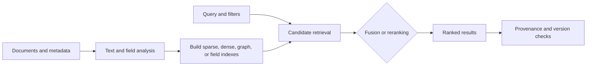
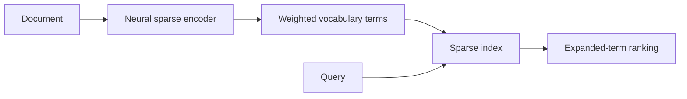
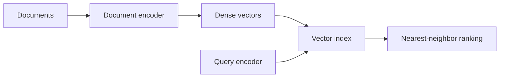
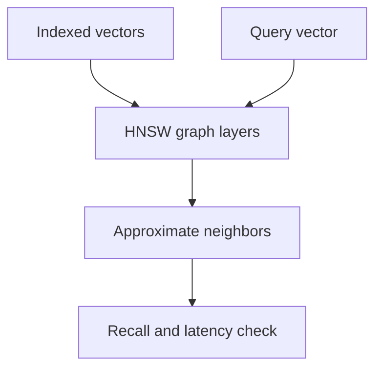
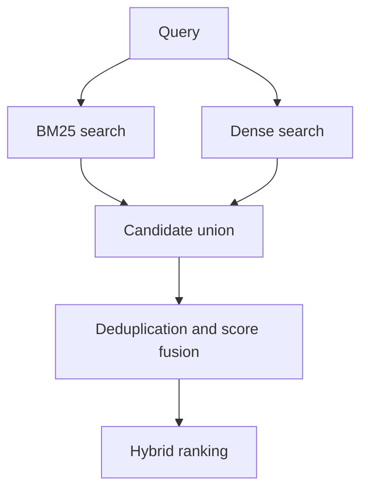
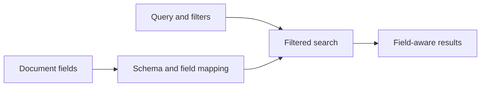
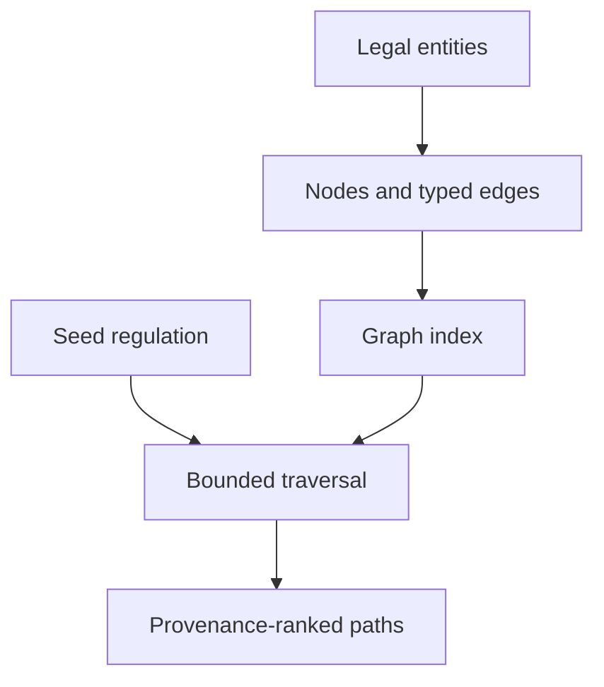
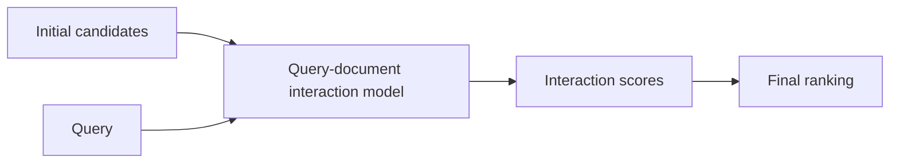
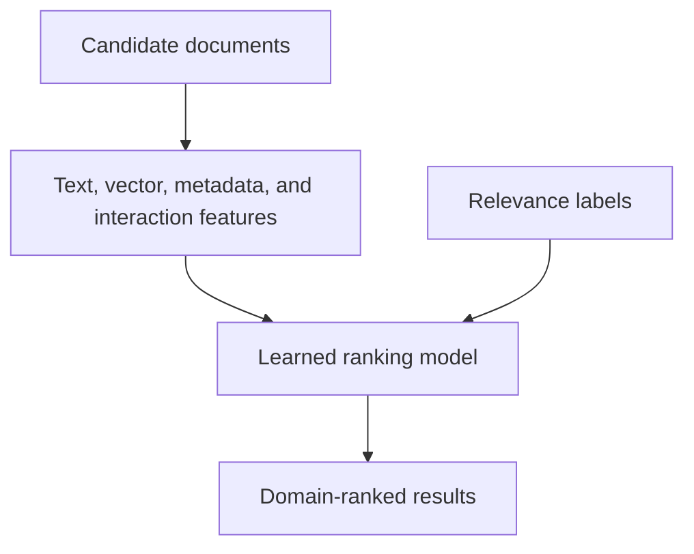

# Literature Review: Legal-Document _Indexing_ and _Retrieval_

## 1. Definition and scope

_Indexing_ is the construction of a data structure that enables efficient searching of a document collection. _Retrieval_ is the process of producing and ranking candidates relevant to a query. In _retrieval-augmented generation_ (RAG), _indexing_ generally includes text representations, metadata, storage structures, and update procedures; _retrieval_ includes candidate search, fusion, filtering, and reranking.

This review covers lexical/sparse indexes, dense vectors, hybrid fusion, metadata and field indexes, graph indexes, _reranking_, and the trade-offs among updates, storage, and latency. _Indexing_ alone does not establish document relevance, answer quality, or the legal validity of a document.

## 2. Taxonomy of approaches

| Approach | Principle and choices | Strengths | Weaknesses, costs, and assumptions | Suitability for legal applications |
|---|---|---|---|---|
| Lexical sparse/BM25 | An _inverted index_ stores terms and frequencies; BM25 balances frequency, rarity, and document length ([Robertson & Zaragoza, 2009](https://doi.org/10.1561/1500000019)) | Highly effective for numbers, specialized terms, names, and exact quotations | Weak for paraphrases; affected by token analysis, normalization, and field length | Important as a baseline because regulation identities and article numbers are lexical |
| Neural sparse | A model produces sparse vocabulary-dimensional representations, for example through term expansion ([Formal et al., 2021](https://doi.org/10.48550/arXiv.2107.05720)) | Retains term-based search while adding semantic matching | More expensive training/inference and potentially larger indexes; the interpretability of expansions requires examination | Promising for synonyms, but requires testing on Indonesian legal terminology |
| Dense vectors | Queries and documents are mapped into a vector space, after which nearest neighbors are searched; DPR uses a _dual encoder_ ([Karpukhin et al., 2020](https://doi.org/10.18653/v1/2020.emnlp-main.550)) | Captures semantic similarity and paraphrases | May miss rare identifiers, negation, numbers, or status; depends on the language and domain of the model | Suitable for conceptual questions, but should not replace the lexical channel |
| ANN and HNSW | Approximates nearest-neighbor search through a hierarchical graph structure ([Malkov & Yashunin, 2020](https://doi.org/10.1109/TPAMI.2018.2889473)) | Reduces search time in large collections | Approximate recall, memory, construction parameters, and update costs must be controlled | An operational choice that can be tested against exact-search recall |
| Hybrid fusion | Combines sparse and dense rankings through score summation, _reciprocal rank fusion_ (RRF), or a trained model | Combines exact and semantic signals without relying on a single representation | Score scales, deduplication, weights, and pipeline latency add complexity; RRF does not understand legal meaning | Relevant for mixed questions; must be compared with each individual baseline |
| Metadata/field index | Separates text, keyword, number, date, type, status, and identifier fields; data types are defined through a _mapping_ ([Elastic, official documentation](https://www.elastic.co/docs/manage-data/data-store/mapping)) | Filters and _boosting_ can restrict the search space and improve auditability | Empty or incorrect metadata may cause _false negatives_; changes in field types often require _reindexing_ | Important for forms, numbers, years, status, dates, and versions, with metadata-source validation |
| Graph index | Stores nodes and relationships for _traversal_, neighbor search, and multi-hop tracing | Represents references, amendments, repeals, and inter-entity relationships | Construction, _entity linking_, relation direction, and temporal updates are costly; result quality depends on graph quality | Suitable for relational and amendment questions when provenance and time are modeled |
| _Reranking_ | Reranks candidates using direct query–document interaction, often with a _cross-encoder_ | Improves relevance modeling over a limited candidate set | Latency and cost increase with the number of candidates; the model may be biased toward linguistic style | Useful as a final stage, but cannot recover candidates that were never retrieved |
| _Learned-to-rank_ | Learns weights for text, vector, metadata, and interaction signals from relevance labels | Can be optimized for the domain and question types | Requires labels and risks _overfitting_ and document/version leakage | Appropriate if Indonesian legal _qrels_ are sufficient and evaluation separation is strict |

### Update, storage, and latency trade-offs

Sparse indexes store vocabularies and posting lists; dense indexes add vector dimensions and ANN structures; graph indexes add nodes, edges, attributes, and possible property indexes. Fusion and _reranking_ add runtime stages. Incremental updates may be less costly than rebuilding, but require handling obsolete documents, mapping changes, versions, _deletion_, and consistency across indexes. The official _mapping_ documentation warns that some field-type changes require _reindexing_ and that dynamic field growth can cause _mapping explosion_ ([Elastic](https://www.elastic.co/docs/manage-data/data-store/mapping)).

## 3. Conceptual pipeline and input/output example

The following diagram is a literature-based reference model for indexing and retrieval. It is not a claim about a particular implementation.



### Example

**Input**

```text
Document: Regulation 12/2024, Article 5
Text: The institution shall retain the record for five years.
Query: Which regulation requires a five-year retention period?
Filter: {status: valid, year: 2024}
```

**Output**

```text
rank 1: {document: Regulation 12/2024, article: 5,
         score: 0.94, matched_fields: [text, year], status: valid}
rank 2: {document: Regulation 8/2022, article: 7,
         score: 0.71, matched_fields: [text], status: repealed}
```

The output should expose enough ranking, filter, and provenance information to distinguish a relevant valid provision from a lexically similar obsolete provision.

## 4. Generic pseudocode

```text
BUILD_BM25_INDEX(documents, analyzer):
    index = inverted_index()
    for document in documents:
        terms = analyzer(document.text)
        index.add(document.id, terms, fields=document.metadata)
    return index

BM25_SEARCH(index, query, filters, k):
    q_terms = index.analyze(query)
    candidates = index.match(q_terms, filters)
    return top_k(score_BM25(document, q_terms) for document in candidates, k)
```

```text
BUILD_DENSE_INDEX(documents, encoder, ann_parameters):
    index = ANN(parameters=ann_parameters)
    for document in documents:
        vector = normalize(encoder.encode(document.text))
        index.add(document.id, vector, metadata=document.metadata)
    index.finalize()
    return index

DENSE_SEARCH(index, query, encoder, filters, k):
    v = normalize(encoder.encode(query))
    return index.nearest(v, k, filters)
```

```text
NEURAL_SPARSE_INDEX(documents, sparse_encoder):
    index = inverted_index()
    for document in documents:
        weights = sparse_encoder.encode(document.text)
        index.add_weighted_terms(document.id, weights, metadata=document.metadata)
    return index

NEURAL_SPARSE_SEARCH(index, query, sparse_encoder, filters, k):
    weights = sparse_encoder.encode(query)
    candidates = index.match_weighted_terms(weights, filters)
    return top_k(score_sparse(candidates, weights), k)
```

```text
ANN_SEARCH(index, query_vector, k, search_parameters):
    candidates = index.approximate_nearest_neighbors(
        query_vector, k, search_parameters)
    return verify_candidate_metadata(candidates)
```

```text
HYBRID_SEARCH(query, sparse_index, dense_index, encoder,
              filters, candidate_k, k, fusion):
    a = BM25_SEARCH(sparse_index, query, filters, candidate_k)
    b = DENSE_SEARCH(dense_index, query, encoder, filters, candidate_k)
    merged = deduplicate_by_document_id(a + b)
    ranked = fusion.combine(a, b, merged)
    return ranked[0:k]
```

```text
FIELD_AWARE_SEARCH(query, structured_filters, text_index, fields, k):
    verified = validate_filters(structured_filters, allowed_schema=fields)
    candidates = text_index.search(query, fields.text_fields, verified)
    candidates = boost_or_filter(candidates, verified, fields.weights)
    return top_k(candidates, k)
```

```text
GRAPH_INDEX(nodes, edges, property_schema):
    graph = empty_graph(property_schema)
    for node in nodes:
        graph.upsert_node(node.id, node.type, node.properties)
    for edge in edges:
        if graph.has_node(edge.source) and graph.has_node(edge.target):
            graph.upsert_edge(edge.source, edge.target,
                              edge.type, edge.properties)
    validate_constraints(graph)
    return graph

GRAPH_SEARCH(seeds, relation_policy, hops, limit):
    paths = graph.traverse(seeds, relation_policy, max_hops=hops)
    paths = rank_paths(paths, provenance=True)
    return paths[0:limit]
```

```text
RERANK(query, candidates, cross_encoder, final_k):
    scored = [(c, cross_encoder.score(query, c.text)) for c in candidates]
    return sort_descending(scored)[0:final_k]
```

```text
LEARNED_TO_RANK(query, candidates, feature_model, final_k):
    features = build_features(query, candidates)
    scores = feature_model.predict(features)
    return top_k(sort_by_score(candidates, scores), final_k)
```

```text
UPDATE_INDEX(change_set, indexes):
    affected = resolve_changed_documents(change_set)
    stale_count = 0
    failures = []
    for index in indexes:
        index.delete_or_version(affected.removed_or_replaced)
        index.upsert(affected.added_or_updated)
        report = verify_consistency(index, change_set.version_id)
        stale_count += report.stale_count
        failures.extend(report.failures)
    rebuild_required = any(index.requires_rebuild() for index in indexes)
    return update_report(stale_count, failures, rebuild_required)
```

## 5. Approach-by-approach visual examples

The examples below illustrate the principal indexing and retrieval transformations. They are methodological examples, not benchmark results or production prescriptions.

### 5.1 Lexical sparse/BM25 indexing


**Input**

```text
Document: Article 5. The institution shall retain the record for five years.
Query: five-year record retention
```

**Output**

```text
postings: {retention: [article_5], record: [article_5], five: [article_5]}
rank 1: article_5, score: 8.42
```

Exact terms and identifiers are easy to trace, but a paraphrase such as “keep records for half a decade” may receive a lower score.

### 5.2 Neural sparse indexing



**Input**

```text
Document: The institution shall retain the record for five years.
Query: keep records for half a decade
```

**Output**

```text
document representation:
  {retain: 1.00, record: 0.92, five_years: 0.87, keep: 0.31}
rank 1: Article 5, sparse-neural score: 0.87
```

The expanded terms may improve semantic matching while retaining an inspectable sparse representation.

### 5.3 Dense-vector indexing



**Input**

```text
Document: The institution shall retain the record for five years.
Query: What is the required record-keeping duration?
```

**Output**

```text
query_vector: [0.12, -0.08, 0.44, ...]
rank 1: Article 5, cosine_similarity: 0.91
```

Dense retrieval can match paraphrases, but the encoder and domain data determine whether numbers, negation, and legal status are represented reliably.

### 5.4 ANN/HNSW search



**Input**

```text
query_vector: [0.12, -0.08, 0.44, ...]
search_parameters: {ef_search: 64, top_k: 3}
```

**Output**

```text
neighbors: [article_5, article_9, article_2]
observed: {latency_ms: 12, approximate_recall: 0.96}
```

Approximate search trades some recall for speed; the trade-off must be measured against an exact-search baseline.

### 5.5 Hybrid fusion



**Input**

```text
Query: Which rule requires keeping records for five years?
Sparse ranking: [article_5, article_8, article_2]
Dense ranking: [article_8, article_5, article_11]
```

**Output**

```text
RRF ranking: [article_5, article_8, article_11, article_2]
```

Fusion can combine exact and semantic evidence, but its ranking should be compared with both individual channels under the same candidate budget.

### 5.6 Metadata and field indexing



**Input**

```text
fields: {title: Regulation 12/2024, article: 5, year: 2024, status: valid}
query: retention period
filter: {year: 2024, status: valid}
```

**Output**

```text
results: [Regulation 12/2024 Article 5]
excluded: [Regulation 8/2022 Article 7, reason: status=repealed]
```

Typed fields make filtering auditable, but incorrect or missing metadata can remove relevant results.

### 5.7 Graph indexing and traversal



**Input**

```text
nodes: [Regulation_12_2024, Article_5, Regulation_3_2020]
edges: [HAS(Regulation_12_2024, Article_5),
       AMENDS(Regulation_12_2024, Regulation_3_2020)]
query: Which earlier regulation was amended?
```

**Output**

```text
path 1: Regulation_12_2024 -AMENDS-> Regulation_3_2020
evidence: {edge_type: AMENDS, source: Regulation_12_2024}
```

Graph results expose relationships that text ranking may miss, but the answer depends on entity linking, relation direction, and source provenance.

### 5.8 Reranking



**Input**

```text
Query: What is the retention period?
Candidates: [Article 8, Article 5, Article 11]
```

**Output**

```text
reranked: [Article 5: 0.93, Article 8: 0.61, Article 11: 0.42]
```

Reranking can improve ordering among retrieved candidates, but it cannot recover a relevant passage absent from the initial candidate set.

### 5.9 Learned-to-rank



**Input**

```text
candidate: Article 5
features: {BM25: 7.2, dense_similarity: 0.88, year_match: 1, valid_status: 1}
label: relevant
```

**Output**

```text
predicted_relevance: 0.97
ranked_result: Article 5
```

The learned model can combine heterogeneous signals, but it requires representative relevance labels and document/version leakage controls.

## 6. Benchmarks, datasets, and metrics

| Source/framework | Measurement focus | Metrics or observations | Limitations |
|---|---|---|---|
| **BEIR** ([Thakur et al., 2021](https://doi.org/10.48550/arXiv.2104.08663)) | Zero-shot retrieval across 18 datasets and model families | nDCG@k, MRR, and Recall@k | Domains and languages are heterogeneous; does not test Indonesian regulation versions |
| **MIRACL** ([Zhang et al., 2022](https://aclanthology.org/2022.miracl-1.1/)) | Multilingual monolingual retrieval | MRR and nDCG | Language availability does not imply suitability for a legal corpus or legal labels |
| **TREC Deep Learning** ([NIST](https://trec.nist.gov/data/deep.html)) | Passage/document ranking with relevance judgments | nDCG, Recall, MRR, and _pool_ judgments | Based on English web corpora; does not measure normative validity |
| **NitiBench** ([Akarajaradwong et al., 2025](https://doi.org/10.48550/arXiv.2502.10868)) | Thai legal retrieval and QA, including complex queries | _Multi-label recall_, coverage, and contradiction | A legal proxy; labels and the legal system cannot be transferred directly |
| Indonesian-language legal _qrels_ | Relevance of chunks, articles, documents, and versions to queries | Precision/Recall@k, MRR, nDCG, _document recall_, and _version accuracy_ | Requires annotation of all necessary sections and document- and time-based separation |
| Graph-quality benchmark | Success of seeds and relationships in expanding candidates | _Seed recall_, _path precision_, _supporting-unit recall_, and _noise ratio_ | Requires a gold graph and provenance |
| Operational benchmark | Search and maintenance efficiency | p50/p95 latency, throughput, errors/timeouts, disk/heap size, update time, and _stale-document rate_ | Highly dependent on hardware, concurrency, caching, and ANN configuration |

Ranking metrics should be calculated on the raw ranking before and after fusion or _reranking_. _Recall@k_ measures the proportion of relevant items found among the top k; MRR emphasizes the position of the first relevant item; nDCG accounts for relevance levels and positions; Precision@k measures the proportion of top results that are relevant. None of these metrics measures whether the final answer correctly interprets a norm.

## 7. Considerations for Indonesian legal documents and regulations

1. Identifier, form, number, year, institution, date, status, and version fields should be separated from full-text fields. [Law No. 12 of 2011](https://peraturan.bpk.go.id/Details/39188/uu-no-12-tahun-2011) documents the types, hierarchy, and drafting techniques of legislation; the official page also indicates that the regulation has undergone amendments. This source supports the need for metadata tracing, not a particular database choice.
2. Queries that mention a number and year require exact matching that must not be displaced by semantic similarity. Conversely, paraphrastic questions require semantic representations. Test both classes separately so that aggregate results do not conceal failures.
3. Valid, repealed, amended, or superseded versions should become auditable search dimensions. An incomplete temporal filter may produce a legal _false positive_ even when the text score is high.
4. Graph-expansion results should be separated from the passage serving as the basis for an answer, with relation type, direction, date, and source visible.
5. If an external _reranker_ or encoder is used, the evaluation should record data-processing policies, network latency, costs, and content-storage limits.

## 8. Neutral comparison framework

- [ ] Are document units, fields, data types, analyzers, vector dimensions, and ANN parameters recorded?
- [ ] Are dense, BM25/sparse, hybrid, and hybrid-with-_reranking_ approaches compared using the same _qrels_ and candidates?
- [ ] Are identifier, semantic, multi-hop, multi-document, amendment, and temporal queries tested separately?
- [ ] Does fusion improve ranking rather than merely increasing the number of candidates or the amount of context?
- [ ] Do metadata filters reduce _false positives_, and are filter-induced _false negatives_ also measured?
- [ ] Do document changes update, delete, or version all indexes consistently?
- [ ] Are disk size, memory, throughput, p50/p95 latency, update cost, timeouts, and _stale rate_ reported?
- [ ] Is the _reranker_ tested only on genuinely available candidates and compared with a no-_reranking_ condition?
- [ ] Does the evaluation split prevent the same document or version from appearing in both training and test data?
- [ ] Can passage provenance and legal metadata be traced to an official source?

## 9. Research gaps and questions

- No open retrieval benchmark specifically combines Indonesian, regulations, multi-section _qrels_, and temporal status.
- The trade-offs among dense representations, neural sparse representations, and BM25 for legal identifiers, paraphrases, and rare terms cannot yet be inferred from general benchmarks.
- Hybrid fusion is often reported using ranking metrics, but its effects on context completeness and answer contradiction require separate measurement.
- The update-cost comparison among lexical, ANN, metadata, and graph indexes for frequently changing regulatory collections remains open.

Defensible research questions are: (1) does hybrid retrieval consistently outperform sparse and dense baselines across different classes of legal queries; (2) how do weights/fusion affect recall, nDCG, latency, and noise; (3) what is the cost of updating versions without leaving obsolete documents; and (4) does _reranking_ improve relevance under a specified latency budget?

## 10. Verified references

- Robertson, S. & Zaragoza, H. (2009). “The Probabilistic Relevance Framework: BM25 and Beyond.” DOI `10.1561/1500000019`, [Foundations and Trends](https://doi.org/10.1561/1500000019).
- Karpukhin, V. et al. (2020). “Dense Passage Retrieval for Open-Domain Question Answering.” DOI `10.18653/v1/2020.emnlp-main.550`, [ACL Anthology](https://aclanthology.org/2020.emnlp-main.550/).
- Cormack, G. V., Clarke, C. L. A. & Büttcher, S. (2009). “Reciprocal Rank Fusion Outperforms Condorcet and Individual Rank Learning Methods.” DOI `10.1145/1571941.1572114`, [ACM](https://doi.org/10.1145/1571941.1572114).
- Malkov, Y. A. & Yashunin, D. A. (2020). “Efficient and Robust Approximate Nearest Neighbor Search Using Hierarchical Navigable Small World Graphs.” DOI `10.1109/TPAMI.2018.2889473`, [IEEE](https://doi.org/10.1109/TPAMI.2018.2889473).
- Formal, T., Piwowarski, B. & Clinchant, S. (2021). “SPLADE: Sparse Lexical and Expansion Model for First Stage Ranking.” DOI arXiv `10.48550/arXiv.2107.05720`, [arXiv](https://arxiv.org/abs/2107.05720).
- Thakur, N. et al. (2021). “BEIR: A Heterogeneous Benchmark for Zero-shot Evaluation of Information Retrieval Models.” DOI arXiv `10.48550/arXiv.2104.08663`, [arXiv](https://arxiv.org/abs/2104.08663).
- Zhang, X. et al. (2022). “MIRACL: A Multilingual Retrieval Dataset Covering 18 Diverse Languages.” [ACL Anthology](https://aclanthology.org/2022.miracl-1.1/).
- Elastic. “Mapping.” [Official documentation](https://www.elastic.co/docs/manage-data/data-store/mapping).
- Audit Board of the Republic of Indonesia. “UU No. 12 Tahun 2011 tentang Pembentukan Peraturan Perundang-Undangan.” [BPK Legal Information and Documentation Network](https://peraturan.bpk.go.id/Details/39188/uu-no-12-tahun-2011).
