# Literature Review: _Knowledge Graphs_ for Legal Documents

## 1. Definition and scope

A _knowledge graph_ (KG) represents knowledge as nodes, directed relationships, attributes, and often _provenance_, thereby enabling entities and relationships to be traced and exchanged. Hogan et al. discuss KGs as a combination of data, schemas, identities, representations, quality, and tasks such as extraction, integration, and querying ([Hogan et al., 2022](https://doi.org/10.1145/3447772)).

In the legal domain, a KG can represent regulations, institutions, document sections, cross-references, amendments, repeals, dates, and sources. This component includes schema/ontology design, entity–relation extraction, identity resolution, temporal and amendment modeling, construction, traversal, and GraphRAG. A KG is distinguished from a text database: the graph exposes structure and relationships, whereas source text provides evidence and normative wording.

## 2. Taxonomy of approaches

| Aspect/approach | Principle | Strengths | Weaknesses and assumptions | Suitability for legal applications |
|---|---|---|---|---|
| Simple triple-based schema | Stores `(subject, predicate, object)` together with attributes and sources | Easy to construct and trace | Type semantics and constraints may be inconsistent | Suitable for prototypes if identifiers and provenance are stable |
| Formal ontology | Defines classes, properties, individuals, constraints, and formal semantics; OWL provides a formal vocabulary and several reasoning profiles ([W3C OWL 2](https://www.w3.org/TR/owl2-overview/)) | Explicit consistency, interoperability, and reasoning | Modeling and maintenance are costly; legal expressions may be richer than a simple schema | Suitable for classes of regulations, sections, actors, actions, and statuses, with a profile appropriate to computational needs |
| Rule-based extraction | Parsers, dictionaries, patterns, and official metadata map entities and relationships | Reproducible, auditable, and strong for explicit patterns | Limited coverage and sensitive to textual variation | Suitable for clearly stated numbers, regulation identities, structures, amendments, and repeals |
| NER and _entity linking_ | Marks entity spans and links them to canonical identifiers | Handles naming variation and coreference | Name ambiguity, abbreviations, OCR, and identical entities may produce _false links_ | Requires Indonesian legal dictionaries and _gold annotations_ |
| Neural/LLM relation extraction | A model predicts relationships from sentences or passages according to a schema | Captures implicit relationships and linguistic variation | Hallucination, incorrect direction, lost negation, cost, and output variability | Must be constrained by an ontology, store source spans and confidence, and undergo verification |
| Hybrid construction | Rules govern mandatory relationships; a model proposes additional relationships | Combines auditability and coverage | Deduplication, conflicts, and source prioritization are more complex | Defensible if generative relationships do not replace official metadata without evidence |
| Temporal/amendment modeling | Stores versions, validity intervals, amendment/repeal events, and states at particular times | Answers _point-in-time_ questions and supports provenance | Requires official snapshots, resolution of partial changes, effective dates, and conflict rules | Highly important; an `AMENDS` relationship without time is insufficient to infer validity status |
| Directed traversal and _seeded retrieval_ | Starts from a relevant entity/passage and traverses relationships subject to hop and type limits | Supports cross-references and multi-hop retrieval; paths can be explained | An incorrect seed or excessively broad traversal produces noise | Suitable for relational questions with boundaries and source evidence |
| Local GraphRAG | Retrieves a subgraph around entities or a local community and combines it with text | Effective for local relationships and entity context | Sensitive to graph and seed quality | Suitable for cross-references, provided that source passages remain included |
| Global/community GraphRAG | Forms entity communities and community summaries for global questions; the original GraphRAG work describes graph construction and community summarization ([Edge et al., 2024](https://doi.org/10.48550/arXiv.2404.16130)) | Handles cross-corpus questions that do not fit a single passage | Summaries may remove exceptions, versions, or normative terms | Suitable only when summaries are linked to sources and distinguished from legal quotations |

## 3. Conceptual pipeline and input/output example

The following diagram is a literature-based reference model for legal knowledge-graph construction and retrieval. It is not a claim about a particular implementation.

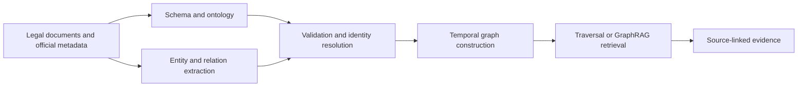

### Example

**Input**

```text
Regulation 12/2024, Article 5: The institution shall retain the record for five years.
Regulation 3/2020: The earlier retention period was three years.
```

**Output**

```text
nodes: [Regulation_12_2024, Article_5, Regulation_3_2020]
edges:
  HAS_SECTION(Regulation_12_2024, Article_5)
  AMENDS(Regulation_12_2024, Regulation_3_2020)
evidence: {source: Regulation_12_2024, span: Article_5, valid_from: 2024}
```

The graph makes the relationship explicit, while the source span remains the evidence for the normative statement.

## 4. Generic pseudocode

```text
DEFINE_SCHEMA():
    class Regulation(id, title, issuer, date, version)
    class Section(id, number, text, source_span)
    class Entity(id, label, canonical_name)
    relation HAS_SECTION(Regulation, Section)
    relation REFERS_TO(Section, Regulation_or_Section)
    relation AMENDS(Regulation_or_Section, Regulation_or_Section)
    relation REPEALS(Regulation_or_Section, Regulation_or_Section)
    relation VALID_DURING(subject, time_interval)
    constraint require_identifier_and_provenance()
    return schema
```

```text
RULE_GRAPH(document, schema):
    G = empty_graph(schema)
    regulation = create_regulation_node(document.metadata)
    G.add(regulation)
    for unit in parse_structure(document):
        section = create_section_node(unit, source_span=unit.span)
        G.add(section)
        G.add_edge(regulation, HAS_SECTION, section, source=unit.span)
    for relation in extract_explicit_relations(document):
        if relation.matches_schema(schema) and source_is_present(relation):
            G.add_or_update(relation, provenance=relation.source_span)
    validate_schema_and_provenance(G)
    return G
```

```text
EXTRACT_ENTITIES_RELATIONS(text, ontology, model):
    spans = model.detect_entities(text, ontology.entity_types)
    entities = link_to_canonical_ids(spans, ontology, reject_ambiguous=true)
    candidates = model.detect_relations(text, entities, ontology.relation_types)
    accepted_relations = []
    for relation in candidates:
        if relation.has_source_span and relation.type in ontology.relation_types:
            emit(relation, confidence=relation.confidence,
                 provenance=relation.source_span)
            accepted_relations.append(relation)
    return deduplicate_and_adjudicate(entities, accepted_relations)
```

```text
TEMPORAL_GRAPH(events, snapshots):
    G = empty_graph()
    for snapshot in snapshots:
        G.add_version(snapshot.document_id, snapshot.effective_interval,
                      source=snapshot.official_source)
    for event in events:
        validate_event_dates(event)
        G.add_event(event.type, event.subject, event.object,
                    effective_at=event.date, source=event.source)
    return build_point_in_time_views(G)
```

```text
BUILD_GRAPHRAG(query, text_retriever, graph, policy):
    text_hits = text_retriever.search(query, policy.text_k)
    seeds = resolve_seeds(text_hits, graph, policy.entity_linking)
    paths = graph.traverse(seeds, relation_types=policy.allowed_relations,
                           max_hops=policy.max_hops)
    evidence = join_paths_with_source_text(paths, text_hits)
    evidence = filter_by_time_and_provenance(evidence, policy)
    return rank_and_deduplicate(evidence, policy.context_limit)
```

```text
EVALUATE_GRAPH(gold, predicted):
    entity_scores = span_or_link_precision_recall_f1(gold.entities,
                                                      predicted.entities)
    relation_scores = relation_precision_recall_f1(gold.relations,
                                                    predicted.relations)
    direction = edge_direction_accuracy(gold.relations, predicted.relations)
    attribution = source_span_coverage(gold, predicted)
    return entity_scores, relation_scores, direction, attribution
```

## 5. Approach-by-approach visual examples

The examples below illustrate graph-construction and graph-retrieval choices. They are conceptual examples, not benchmark results or production prescriptions.

### 5.1 Simple triple-based schema

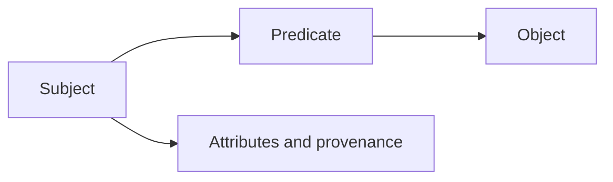

**Input**

```text
Regulation 12/2024 contains Article 5.
```

**Output**

```text
(Regulation_12_2024, HAS_SECTION, Article_5)
provenance: {source: Regulation_12_2024, span: Article 5}
```

Triples are easy to inspect, but the schema must still define relation direction, types, and source evidence.

### 5.2 Formal ontology

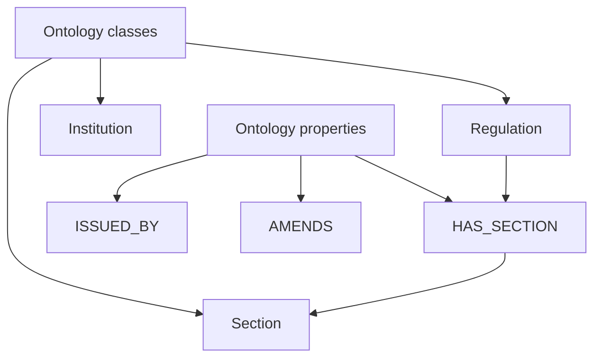

**Input**

```text
Regulation 12/2024 was issued by the Ministry and contains Article 5.
```

**Output**

```text
class assertions:
  Regulation_12_2024 : Regulation
  Ministry_X : Institution
  Article_5 : Section
property assertions:
  ISSUED_BY(Regulation_12_2024, Ministry_X)
  HAS_SECTION(Regulation_12_2024, Article_5)
```

Formal classes and constraints improve interoperability, but the ontology may not capture every legal expression without extensions.

### 5.3 Rule-based extraction

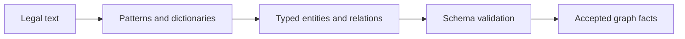

**Input**

```text
Article 5 refers to Regulation 3/2020.
```

**Output**

```text
REFERS_TO(Article_5, Regulation_3_2020)
source_span: "refers to Regulation 3/2020"
confidence: rule_match
```

Rules are auditable for explicit legal patterns, but they can miss variation and implicit relations.

### 5.4 NER and entity linking

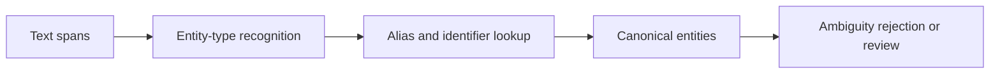

**Input**

```text
The Ministry issued Regulation 12/2024.
```

**Output**

```text
mentions:
  "The Ministry" -> Institution: Ministry_X
  "Regulation 12/2024" -> Regulation: Regulation_12_2024
link_status: accepted
```

Identity resolution should reject ambiguous matches rather than silently connecting two similar legal entities.

### 5.5 Neural or LLM relation extraction

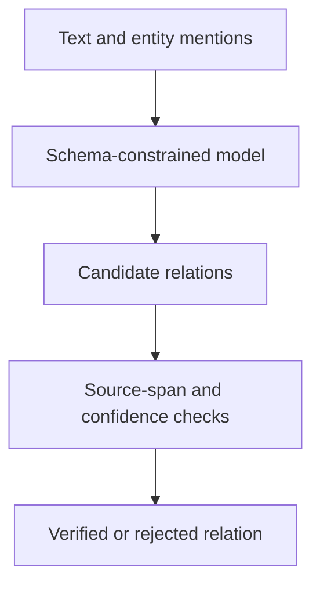

**Input**

```text
Regulation 12/2024 replaces Regulation 3/2020 from 1 January 2024.
```

**Output**

```text
candidate: REPLACES(Regulation_12_2024, Regulation_3_2020)
effective_date: 2024-01-01
source_span: "replaces ... from 1 January 2024"
status: pending verification
```

Model-produced relations require schema, direction, date, source-span, and confidence checks before graph insertion.

### 5.6 Hybrid graph construction

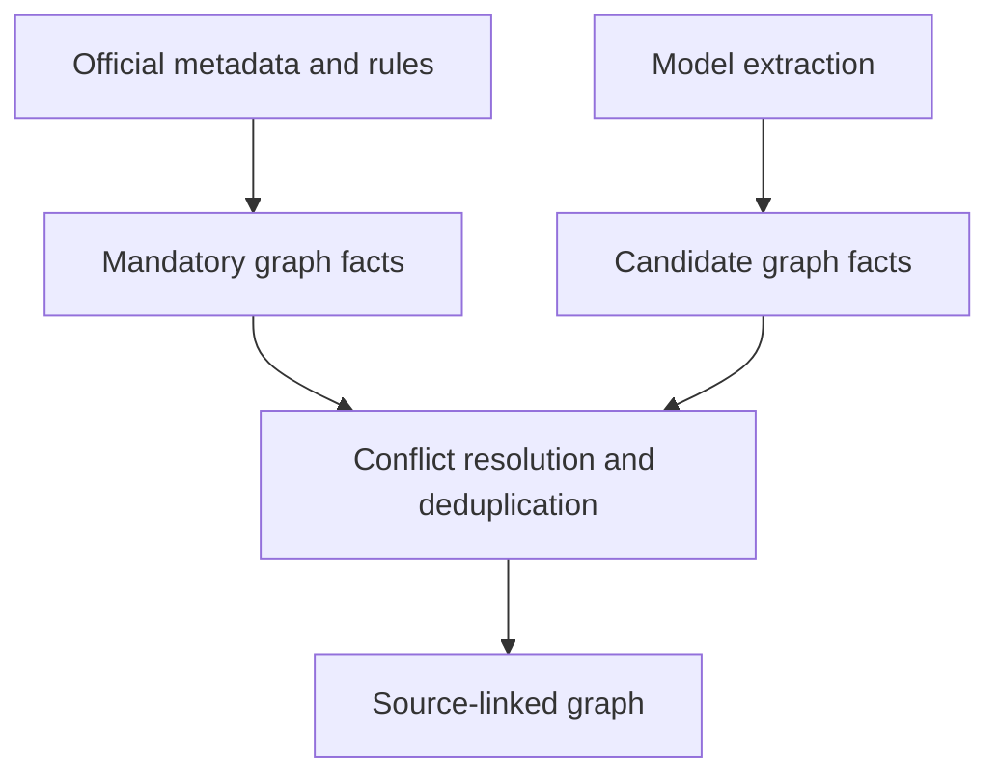

**Input**

```text
Official metadata: Regulation 12/2024 amends Regulation 3/2020.
Model candidate: Regulation 12/2024 replaces Regulation 3/2020.
```

**Output**

```text
accepted: AMENDS(Regulation_12_2024, Regulation_3_2020)
candidate: REPLACES(...), status: requires adjudication
```

Hybrid construction can improve coverage while preventing an unsupported model relation from replacing an official fact.

### 5.7 Temporal and amendment modeling

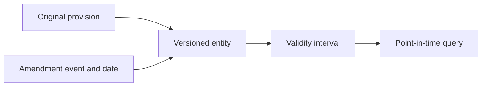

**Input**

```text
Original: Article 5 requires three years, valid from 2020.
Amendment: Article 5 requires five years, valid from 2024.
Query date: 2022-06-01
```

**Output**

```text
selected version: Article_5_v2020
validity: [2020-01-01, 2024-01-01)
```

Temporal modeling prevents a current provision from being returned for a historical query.

### 5.8 Directed traversal and seeded retrieval

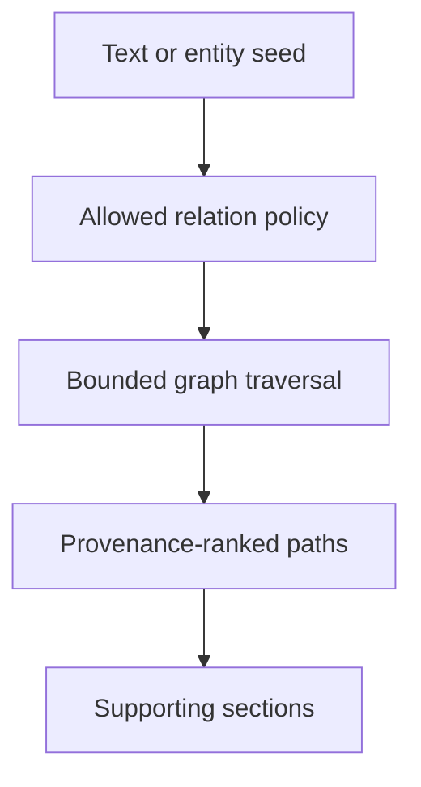

**Input**

```text
seed: Regulation_12_2024
allowed_relations: [AMENDS, HAS_SECTION]
max_hops: 2
```

**Output**

```text
path 1: Regulation_12_2024 -HAS_SECTION-> Article_5
path 2: Regulation_12_2024 -AMENDS-> Regulation_3_2020
```

Hop limits, relation types, direction, and provenance constrain graph expansion and reduce unrelated results.

### 5.9 Local GraphRAG

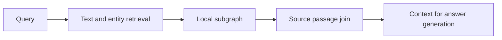

**Input**

```text
Query: Which regulation changed the five-year retention requirement?
Seed: Article_5
```

**Output**

```text
local context:
  Article_5
  Regulation_12_2024 -AMENDS-> Regulation_3_2020
  source passages for both regulations
```

Local GraphRAG can combine relational context with source text, but seed and graph quality determine the retrieved context.

### 5.10 Global or community GraphRAG

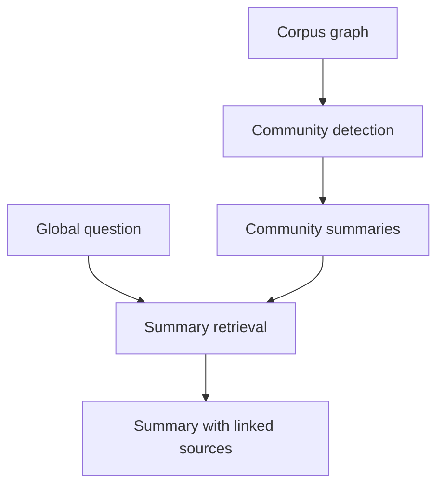

**Input**

```text
Question: What institutions and regulations govern record retention across the corpus?
Communities: {health regulations, financial regulations, archival regulations}
```

**Output**

```text
summary: "The corpus contains three regulatory communities with different retention rules."
source_links: [community_1_docs, community_2_docs, community_3_docs]
```

Community summaries support global questions, but every summary claim must remain traceable and must not be treated as the legal quotation itself.

## 6. Data, benchmarks, and metrics

| Dataset/framework | Focus | Measurement | Limitations |
|---|---|---|---|
| **FB15k-237** and **WN18RR** | Relation prediction/link prediction | MRR and Hits@1/3/10 | General datasets; do not contain temporality or legal semantics |
| **WebQuestionsSP** and **ComplexWebQuestions** | KG question answering and multi-hop retrieval | Answer F1/Exact Match, Hits, and path success | Primarily general and English-language domains; do not test regulatory status |
| **HotpotQA** and **MuSiQue** | Evidence-based multi-hop reasoning | EM/F1 and supporting-fact recall | Tests reasoning rather than KG-construction and ontology quality |
| **GraphRAG** ([Edge et al., 2024](https://doi.org/10.48550/arXiv.2404.16130)) | Global entity-graph-based QA/QFS and community summarization | Comprehensiveness, diversity, and output assessment | General/preprint study; community summaries are not equivalent to normative evidence |
| Annotated Indonesian legal KG | Nodes, _entity linking_, relation type/direction, time, and source | Entity and relation precision/recall/F1, direction accuracy, _duplicate/dangling rate_, and _source attribution_ | Requires expert annotation, identity rules, and official snapshots |
| Graph-retrieval evaluation | Seeds, paths, supporting relationships, and final context | _Seed recall_, _path precision/recall_, supporting-section recall, _path noise_, context completeness, and latency | Highly sensitive to the definitions of relevance and traversal boundaries |

The number of nodes or edges is not a quality metric. For extraction, calculate at least precision, recall, and F1 separately for spans, entity types, identity links, relation types, and directed pairs. For temporality, measure interval accuracy, status on the query date, and the ability to reject claims when the snapshot is insufficient. For GraphRAG, evaluate retrieval and generation separately, then check whether each claim has a supporting node/path and source text.

## 7. Considerations for Indonesian legal documents and regulations

1. [Law No. 12 of 2011](https://peraturan.bpk.go.id/Details/39188/uu-no-12-tahun-2011) provides the official framework for the types, hierarchy, subject matter, and drafting techniques of legislation. The same page records amendments to the law. A KG model should therefore distinguish documents, sections, amendments, and versions; this official source does not prescribe a particular software ontology.
2. Relationships representing amendments, repeals, replacements, and cross-references should have a direction, date, action type, subject, object, and source-text range. Relationships without evidence should be marked as candidates or rejected rather than treated as normative facts.
3. The question “valid on a particular date” differs from the question “ever contained the provision.” A KG should support _point-in-time queries_ and store the snapshot used. [Law No. 13 of 2022](https://peraturan.bpk.go.id/Details/212810/uu-no-13-tahun-2022) can be used as an official source for tracing amendments to Law No. 12 of 2011.
4. Indonesian terms, institutional abbreviations, regulation numbers, and article references require _entity linking_ that does not rely solely on name similarity. _Aliases_, official IDs, and disambiguation rules should be evaluated.
5. Community summaries or model outputs should be separated from regulatory text. Legal answers should provide paths and source quotations, while graph inference should be labeled as reasoning or context expansion.

## 8. Neutral comparison framework

- [ ] Are classes, relationships, identifiers, constraints, versions, time intervals, and provenance defined before extraction?
- [ ] Can the schema distinguish official sources, extracted facts, model proposals, and traversal inferences?
- [ ] Does _entity linking_ test aliases, abbreviations, OCR, number conflicts, and similar entities?
- [ ] Are relationships tested for type, direction, negation, source span, target, and time?
- [ ] Are rule-based, model-based, and hybrid construction compared using the same documents and ontology?
- [ ] Does every edge have source and target nodes, a stable ID, and provenance?
- [ ] Are temporal queries tested on multiple dates and amendment/repeal states?
- [ ] Does traversal limit hops, relationship types, directions, result counts, and duplication?
- [ ] Are _text-only_, _graph-only_, and GraphRAG compared using _seed recall_, path precision, ranking, context completeness, contradiction, and latency?
- [ ] Can every graph summary be traced back to source text, and is it prevented from being treated as a normative quotation?

## 9. Research gaps and questions

- No open benchmark currently combines Indonesian regulations, legal entities, amendment relationships, validity intervals, and source evidence.
- Legal relation extraction is difficult because of partial amendments, indirect references, negation, and dependence on versions.
- It remains unclear when graph expansion improves recall and when it adds noise or introduces provisions that are no longer valid.
- GraphRAG evaluation often assesses the final answer, although errors may originate in the ontology, _entity linking_, edge, traversal, or generation model.

Defensible research questions are: (1) how does schema design affect the precision, recall, and auditability of a legal graph; (2) does hybrid construction increase coverage without increasing unsupported relationships; (3) how does temporal representation affect the accuracy of _point-in-time_ questions; and (4) does GraphRAG improve _supporting-section recall_ and answer quality compared with text retrieval under the same latency budget?

## 10. Verified references

- Hogan, A. et al. (2022). “Knowledge Graphs.” DOI `10.1145/3447772`, [ACM](https://doi.org/10.1145/3447772).
- W3C OWL Working Group. (2012). “OWL 2 Web Ontology Language Document Overview.” [W3C Recommendation](https://www.w3.org/TR/owl2-overview/).
- Edge, D. et al. (2024). “From Local to Global: A Graph RAG Approach to Query-Focused Summarization.” DOI arXiv `10.48550/arXiv.2404.16130`, [arXiv](https://arxiv.org/abs/2404.16130).
- Bordes, A. et al. (2013). “Translating Embeddings for Modeling Multi-relational Data.” DOI `10.48550/arXiv.1301.3485`, [arXiv](https://arxiv.org/abs/1301.3485).
- Muninggar, N. S. & Krisnadhi, A. A. (2023). “LexID: A Legal Knowledge Graph for Indonesian Regulation.” DOI `10.21609/jiki.v16i1.1096`, [DOI](https://doi.org/10.21609/jiki.v16i1.1096).
- Audit Board of the Republic of Indonesia. “UU No. 12 Tahun 2011 tentang Pembentukan Peraturan Perundang-Undangan.” [BPK Legal Information and Documentation Network](https://peraturan.bpk.go.id/Details/39188/uu-no-12-tahun-2011).
- Audit Board of the Republic of Indonesia. “UU No. 13 Tahun 2022 tentang Perubahan Kedua atas UU No. 12 Tahun 2011.” [BPK Legal Information and Documentation Network](https://peraturan.bpk.go.id/Details/212810/uu-no-13-tahun-2022).
