# Literature Review: PII Detection and Sanitization

## 1. Definition and scope

Personally identifiable information (PII) is information that can be used to distinguish or trace an individual’s identity, either directly or in combination with other information. NIST emphasizes that the determination of PII is contextual and that its protection encompasses the risks of inappropriate access, use, and disclosure ([NIST SP 800-122](https://doi.org/10.6028/NIST.SP.800-122)).

PII sanitization includes span and entity-type detection, selection of a protection action, value transformation, key or mapping management when recovery is possible, and leakage and utility testing. Sanitization is not synonymous with _anonymization_: replacement with a recoverable token is _pseudonymization_ or reversible tokenization, not the elimination of identification risk. This scope distinguishes corpus, query, log, prompt, output, and intermediate-artifact detection.

## 2. Taxonomy of approaches

| Approach | Principle | Strengths | Weaknesses and assumptions | Suitability for legal contexts |
|---|---|---|---|---|
| Rules/regex | Searches for patterns such as email addresses, telephone numbers, identity numbers, bank accounts, URLs, or structured formats | Fast, deterministic, and easy to audit | Does not understand context; regulation and article numbers may become _false positives_ | Effective for identifiers with stable formats, provided that rules distinguish legal identifiers from personal data |
| Statistical/neural NER | Marks spans such as PERSON, ORG, LOC, DATE, or MONEY using a token model | Captures linguistic and contextual variation | _Domain shift_, span-boundary errors, language bias, and name ambiguity | Requires Indonesian-language annotation data covering personal names and legal entities |
| Dictionary _recognizer_ | Matches registered names, aliases, or patterns | Effective for closed lists and auditable | Not robust to new entities, typographical errors, or varied contexts | Useful as a supplement, not as a sole detector |
| Hybrid rules + NER | Combines candidates, resolves overlaps, and selects candidates according to priorities or thresholds | Balances pattern precision and contextual coverage | Overlap resolution and prioritization may remove correct spans | Generally most defensible after testing by type and against legal _near-misses_ |
| Redaction/deletion | Permanently removes a value or replaces it with `[REDACTED]` | No mapping can leak back | May remove coreference and reduce retrieval utility | Suitable when the original value is not needed for subsequent tasks |
| Masking | Replaces part or all of a value with characters or a generic token | Simple and may preserve form | Partial information may remain identifying; identical tokens may reveal coreference | Requires risk analysis for dates, numbers, and attribute combinations |
| Pseudonymization | Replaces a value with a substitute identifier and stores the relationship separately | Preserves coreference and permits controlled recovery | The mapping is a sensitive asset; unauthorized access has direct consequences | Appropriate only when access separation, encryption, retention, and auditing are applied |
| Tokenization | Generates random or deterministic tokens, with an optional vault or recovery mechanism | Reversibility and consistency can be defined | Deterministic tokens can be tracked; a vault increases security responsibilities | Select reversibility according to the legal purpose, not convenience alone |
| Formal anonymization | Applies transformations to reduce the probability of identification, such as generalization or aggregation | Reduces direct association with an individual | Difficult to guarantee protection against combinations of attributes and external information | Requires risk assessment rather than merely checking placeholders |
| Differential privacy | Adds measured noise to statistics or aggregate releases | Provides formal privacy parameters for specific uses | Not directly suitable for preserving individual queries and exact identifiers | Primarily relevant to statistics or training, not to exact legal-query sanitization |

## 3. Conceptual pipeline and input/output example

The following diagram is a literature-based reference model for PII detection and sanitization. It is not a claim about a particular implementation.

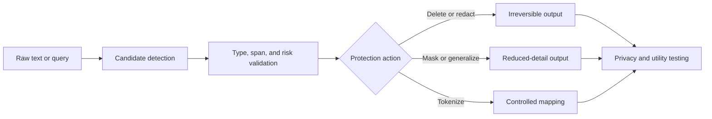

### Example

**Input**

```text
Contact the applicant Aisha Rahman at aisha@example.org before 12 May 2024.
```

**Output**

```text
Contact the applicant PERSON_001 at EMAIL_001 before DATE_001.
mapping_policy: {reversible: false, scope: query_session, retention: none}
```

The output preserves task structure while removing direct values; the protection claim remains incomplete until leakage and re-identification tests are performed.

## 4. Generic pseudocode

```text
RULE_DETECT(text, patterns):
    candidates = []
    for rule in patterns:
        for span in rule.find(text):
            candidates.append(type=rule.entity_type, span=span,
                              confidence=rule.confidence)
    return candidates
```

```text
NER_DETECT(text, model, allowed_types):
    predictions = model.predict_tokens(text)
    results = []
    for entity in merge_token_spans(predictions):
        if entity.type in allowed_types:
            results.append(entity)
    return results
```

```text
HYBRID_DETECT(text, rules, ner_model, allowed_types, threshold, priority):
    candidates = RULE_DETECT(text, rules) + NER_DETECT(text, ner_model,
                                                       allowed_types)
    candidates = [c for c in candidates
                  if c.confidence >= threshold[c.type]]
    return choose_non_overlapping(candidates, priority)
```

```text
IRREVERSIBLE_REDACT(text, detections):
    output = text
    for detection in sort_by_start_descending(detections):
        output = replace(output, detection.span,
                         "[REDACTED:" + detection.type + "]")
    return output, mapping=None

TOKENIZE(text, detections, vault, reversible, policy):
    mapping = {}
    output = text
    for detection in sort_by_start_descending(detections):
        token = generate_scoped_token(detection.type)
        if reversible:
            vault.store(token, original=text[detection.span],
                       access_policy=policy)
        mapping[token] = detection.type
        output = replace(output, detection.span, token)
    return output, mapping
```

```text
PRIVACY_UTILITY_EVALUATION(raw_query, sanitizer, task):
    safe_query = sanitizer.transform(raw_query)
    raw_result = task.retrieve_or_classify(raw_query)
    safe_result = task.retrieve_or_classify(safe_query)
    privacy = leakage_and_reidentification_tests(raw_query, safe_query)
    utility = compare_metrics(raw_result, safe_result)
    return privacy, utility
```

## 5. Approach-by-approach visual examples

The examples below illustrate detection and protection transformations. They are conceptual examples, not benchmark results or production prescriptions.

### 5.1 Rules and regular expressions

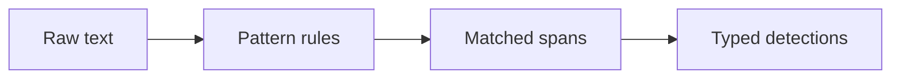

**Input**

```text
Email: aisha@example.org
Regulation: 12/2024
```

**Output**

```text
EMAIL: "aisha@example.org"
not PII: "12/2024" because it matches a legal identifier rule
```

Rules are precise for stable formats, but legal identifiers must be tested as explicit near-misses.

### 5.2 Statistical or neural NER

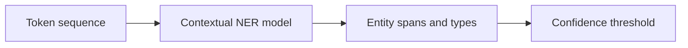

**Input**

```text
The applicant Aisha Rahman submitted the form.
```

**Output**

```text
PERSON: "Aisha Rahman", confidence: 0.94
```

Contextual models can detect varied expressions, but language, domain, and span-boundary errors require class-specific evaluation.

### 5.3 Dictionary recognizer

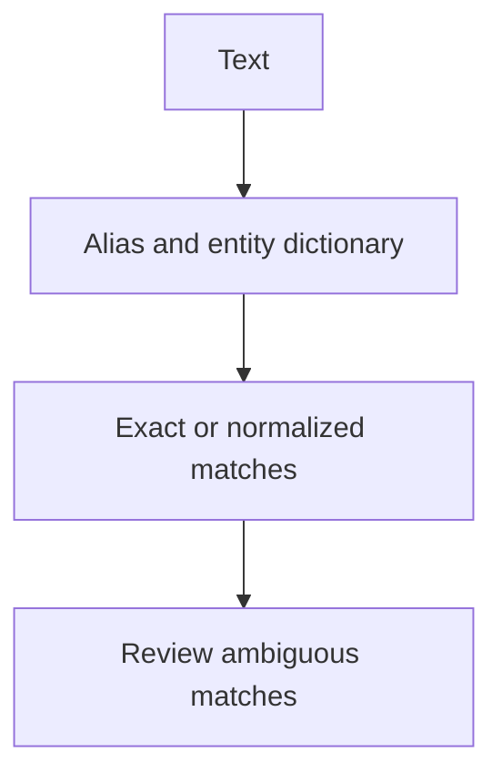

**Input**

```text
The Ministry of Finance approved the request.
dictionary: {"Ministry of Finance": ORG}
```

**Output**

```text
ORG: "Ministry of Finance", source: dictionary
```

Dictionaries are auditable for closed lists, but they do not cover unseen names or all contextual uses.

### 5.4 Hybrid rules and NER

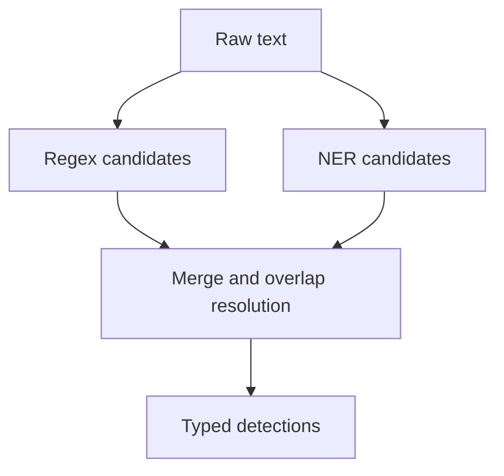

**Input**

```text
Contact Aisha Rahman at aisha@example.org.
```

**Output**

```text
PERSON: "Aisha Rahman", source: NER
EMAIL: "aisha@example.org", source: regex
```

Hybrid detection can cover complementary failure modes, but priority and overlap policies must be explicit.

### 5.5 Redaction or deletion

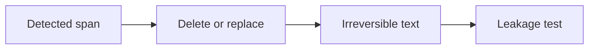

**Input**

```text
Applicant: Aisha Rahman, email: aisha@example.org
```

**Output**

```text
Applicant: [REDACTED:PERSON], email: [REDACTED:EMAIL]
mapping: none
```

Irreversible removal avoids mapping recovery but may reduce coreference and retrieval utility.

### 5.6 Masking

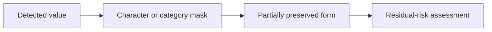

**Input**

```text
Account: 1234567890
```

**Output**

```text
Account: ******7890
```

Visible suffixes and lengths may remain identifying when combined with other attributes.

### 5.7 Pseudonymization

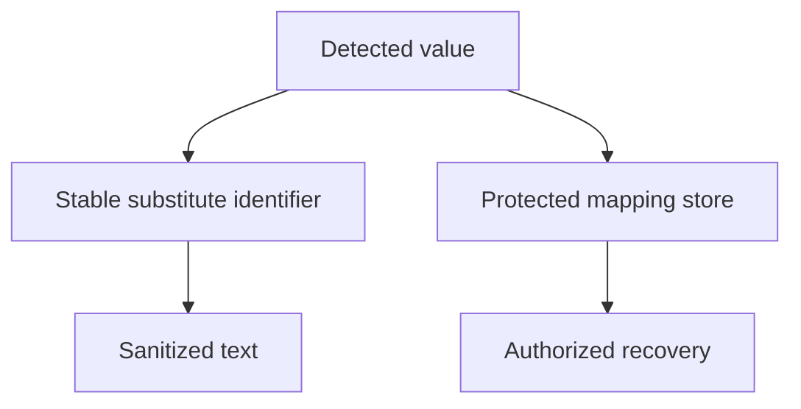

**Input**

```text
Applicant Aisha Rahman filed the request. Later: Aisha Rahman withdrew it.
```

**Output**

```text
Applicant PERSON_001 filed the request. Later: PERSON_001 withdrew it.
mapping_store: {PERSON_001: Aisha Rahman}
```

Stable substitutions preserve coreference, but the mapping is a sensitive asset and must be separately controlled.

### 5.8 Tokenization

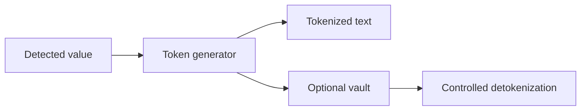

**Input**

```text
Phone: +62 812 3456 7890
```

**Output**

```text
Phone: PHONE_tok_7f3a
vault: {PHONE_tok_7f3a: +62 812 3456 7890}
```

Random and deterministic tokens have different consistency and tracking risks; the chosen mode should follow the task and threat model.

### 5.9 Formal anonymization

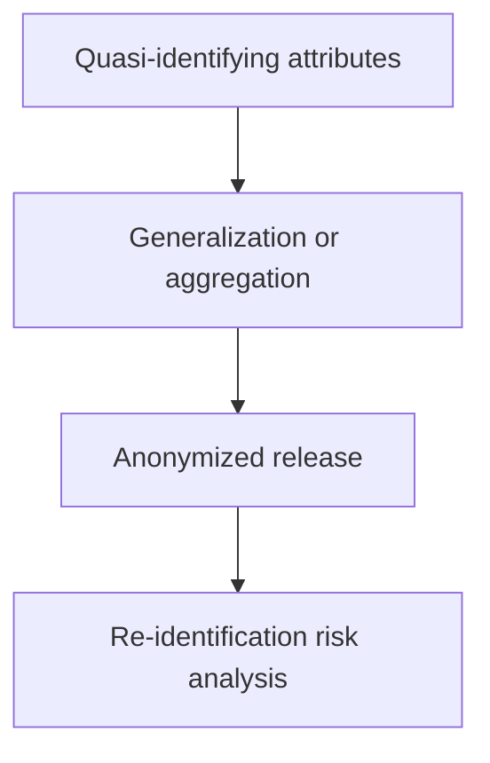

**Input**

```text
Age: 37, City: Bandung, Occupation: archivist
```

**Output**

```text
Age: 35-39, Region: West Java, Occupation: records professional
```

Generalization reduces specificity, but protection depends on external information and the complete released dataset.

### 5.10 Differential privacy

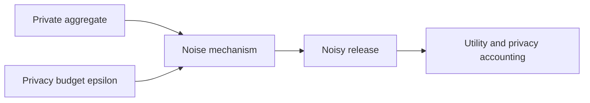

**Input**

```text
Private query: number of records containing a PERSON entity
True count: 120
epsilon: 1.0
```

**Output**

```text
Released count: 117
privacy_accounting: {epsilon: 1.0, delta: 0}
```

Differential privacy is designed for aggregate release and is not a direct replacement for exact-value sanitization in individual legal queries.

## 6. Data, benchmarks, and metrics

| Dataset/framework | Measurement focus | Metrics | Limitations |
|---|---|---|---|
| **CoNLL-2003** ([Tjong Kim Sang & De Meulder, 2003](https://aclanthology.org/W03-0419/)) | NER for PERSON, ORGANIZATION, LOCATION, and MISC in news | Span/entity precision, recall, and F1 | Not a comprehensive PII dataset and not Indonesian or legal |
| Synthetic Indonesian PII dataset | PII-format variation and non-PII _near-misses_ | Precision, recall, and F1 by type, _false-positive rate_, and _boundary error_ | Synthetic data may not represent real-world variation; real identity values require a processing basis |
| Annotated legal corpus | PII in party names, addresses, numbers, contacts, and non-PII identifiers | Micro/macro precision, recall, F1, and confusion matrices | Requires annotators and rules for distinguishing legal entities from data subjects |
| Leakage and re-identification testing | Whether original values can be recovered from outputs, logs, embeddings, prompts, or attribute combinations | _Exact leakage rate_, _unauthorized restoration rate_, token consistency, and re-identification success rate | No single metric covers all threat models; k-anonymity is not a universal guarantee |
| Paired privacy–utility evaluation | Task differences between raw and sanitized inputs | ΔRecall@k, ΔMRR/nDCG, intent accuracy, context relevance, and time | High utility does not establish privacy; high privacy may remove important information |
| Governance audit | Retention, access, encryption, transfer, and separation of environments | TTL compliance, encryption evidence, access audits, deletion coverage, and processor controls | Technical metrics must be mapped to applicable legal obligations |

Precision measures the proportion of correct detections; recall measures the proportion of labeled PII that is found; F1 is the harmonic mean of precision and recall. Calculations should be performed for spans and types and separated by class. _Re-identification evaluation_ must define the attacker, background information, token/vault access, and success threshold before the experiment.

## 7. Considerations for Indonesian legal documents and regulations

1. [Law No. 27 of 2022 on Personal Data Protection](https://peraturan.bpk.go.id/Details/229798/uu-no-27-tahun-2022) regulates personal-data categories, data-subject rights, processing, controller and processor obligations, transfers, sanctions, and prohibitions. The official page distinguishes specific and general personal data, including personal financial data as an example of specific data and a full name as an example of general data. This classification provides a basis for legal analysis; it does not prescribe a detection library or algorithm.
2. Legal documents may contain personal names, addresses, identity numbers, bank accounts, or case information alongside article numbers, years, and regulation numbers that are not PII. The evaluation system should include these _near-misses_ so that protection does not damage legal retrieval.
3. Sanitization should be analyzed throughout the data life cycle: input, normalization, logging, storage, embedding, external services, prompts, outputs, backups, and recovery. Replacing a value in one view does not establish that other copies are safe.
4. If recovery is required, mappings should be separated by purpose and subject, access-protected, encrypted, governed by defined retention, and audited. The details of the obligations should be interpreted together with the statutory text and applicable policies.
5. _Anonymization_, pseudonymization, and tokenization should be reported using precise terminology. A token that can be mapped back must not be described as permanent anonymization.

## 8. Neutral comparison framework

- [ ] Are PII classes, annotation units, span rules, and threat definitions established before testing?
- [ ] Are regex, NER, dictionary, and hybrid approaches compared using positive data, negative data, corrupted formats, and legal _near-misses_?
- [ ] Are precision, recall, F1, _boundary error_, and _false-positive rate_ reported by class and in aggregate?
- [ ] Does the transformation specify whether the value is deleted, masked, pseudonymized, or tokenized?
- [ ] If reversible, does the vault/mapping have access controls, encryption, TTL, auditing, isolation, and deletion procedures?
- [ ] Are raw values tested against logs, caches, embeddings, prompts, outputs, backups, and third-party services?
- [ ] Is re-identification tested using a stated threat model and background information?
- [ ] Is utility compared on the same task using paired queries?
- [ ] Are synthetic data and authorized real data distinguished in reporting?
- [ ] Are claims of “compliance with the Personal Data Protection Law” separated from technical detection results and legally reviewed?

## 9. Research gaps and questions

- Indonesian legal PII datasets covering personal identifiers and regulation-number _near-misses_ remain limited.
- Recall for names, addresses, and context-dependent data is not adequately represented by regex or general news-domain NER.
- The relationship among sanitization strategy, coreference, and legal retrieval requires paired privacy–utility evaluation.
- Re-identification risk from combinations of metadata, time, and sanitized text is often not tested as an end-to-end threat.
- No consensus single metric exists for asserting PII safety in pipelines that use external providers.

Defensible research questions are: (1) does a rule–NER hybrid improve PII F1 without increasing _false positives_ for legal identifiers; (2) how does the degree of reversibility affect utility and re-identification risk; (3) do particular generalization or redaction strategies preserve retrieval and intent; and (4) how do retention and access policies affect leakage risk throughout the data life cycle?

## 10. Verified references

- McCallister, E., Grance, T. & Scarfone, K. (2010). “Guide to Protecting the Confidentiality of Personally Identifiable Information (PII), NIST SP 800-122.” DOI `10.6028/NIST.SP.800-122`, [NIST](https://csrc.nist.gov/pubs/sp/800/122/final).
- Tjong Kim Sang, E. F. & De Meulder, F. (2003). “Introduction to the CoNLL-2003 Shared Task: Language-Independent Named Entity Recognition.” [ACL Anthology](https://aclanthology.org/W03-0419/).
- Microsoft. “Presidio: Data Protection and De-identification SDK.” [Official documentation](https://microsoft.github.io/presidio/).
- Sweeney, L. (2002). “k-Anonymity: A Model for Protecting Privacy.” DOI `10.1023/A:1012916026649`, [Springer](https://doi.org/10.1023/A:1012916026649).
- Narayanan, A. & Shmatikov, V. (2008). “Robust De-anonymization of Large Sparse Datasets.” DOI `10.1109/SP.2008.33`, [IEEE](https://doi.org/10.1109/SP.2008.33).
- Audit Board of the Republic of Indonesia. “UU No. 27 Tahun 2022 tentang Pelindungan Data Pribadi.” [BPK Legal Information and Documentation Network](https://peraturan.bpk.go.id/Details/229798/uu-no-27-tahun-2022).
